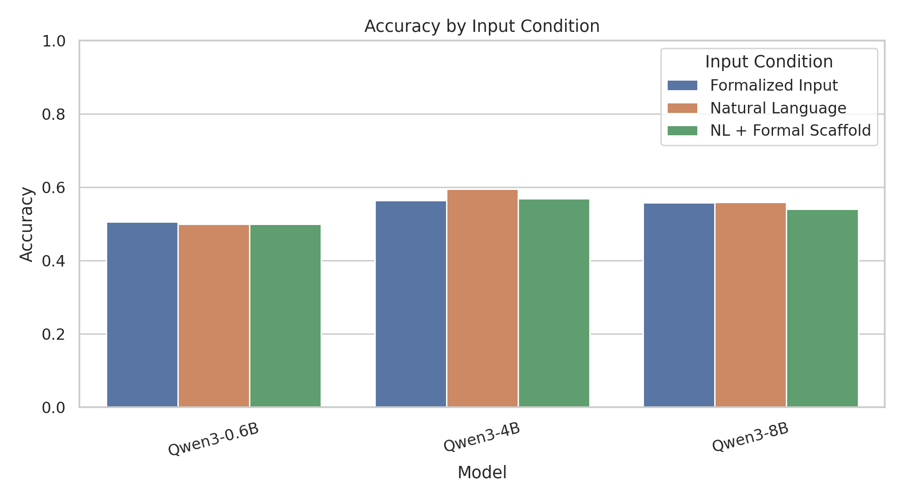
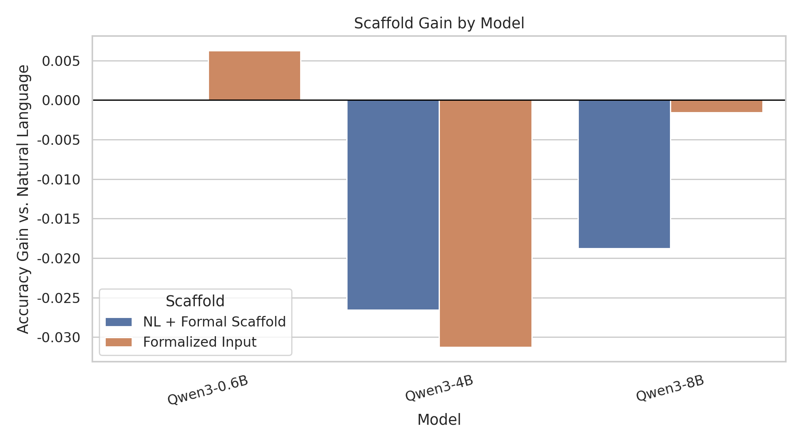
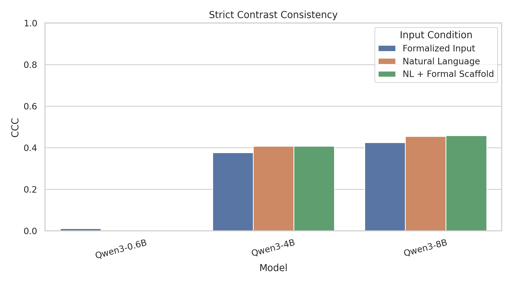
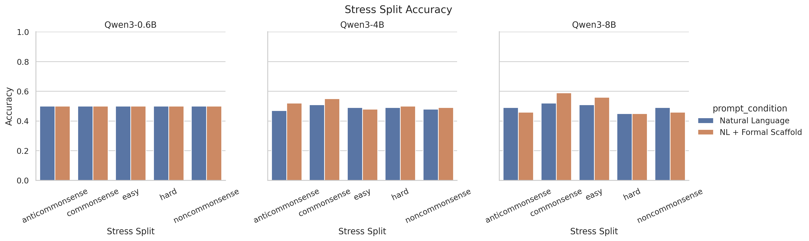
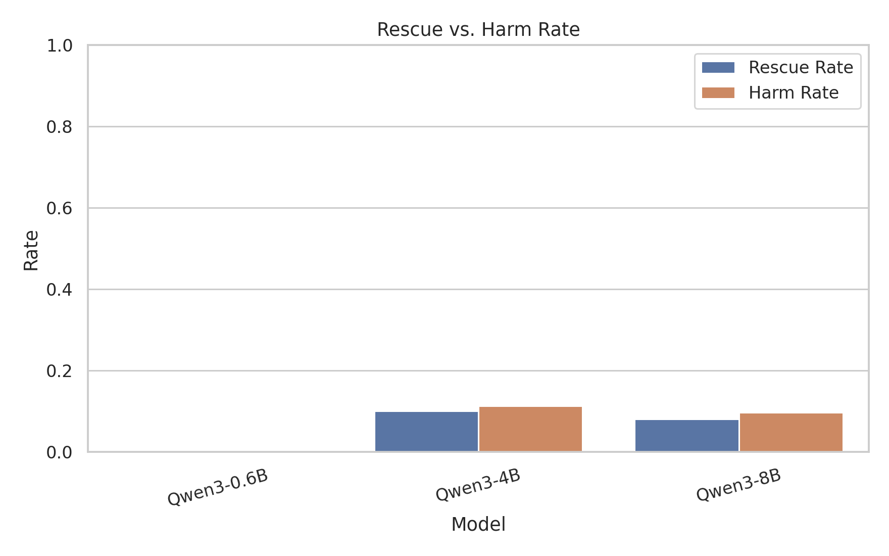
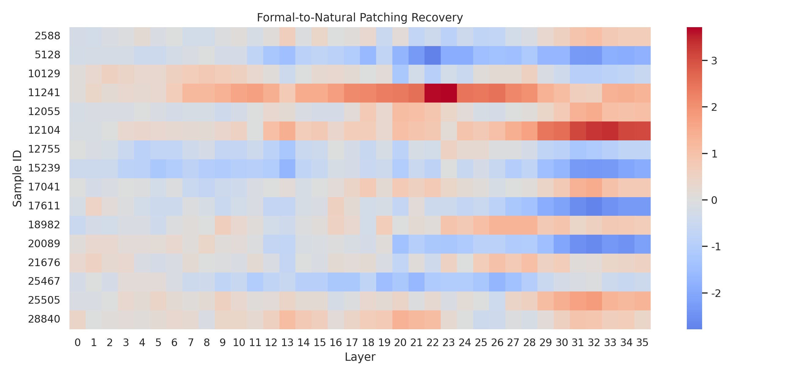

# MLISE 2026 Qwen 因果诊断实验报告

## 1. 实验概述

- 实验时间：2026-05-13 07:25:23
- run_id：`diagnostic_20260513_151831`
- 样本模式：`formal`
- 实验目标：在上一轮规模对比区分度不足的基础上，诊断 Qwen 模型在 CLadder 中的失败主要来自自然语言因果结构抽取，还是来自形式化因果运算不稳定。
- 图表标题、坐标轴、图例均使用英文，便于后续直接进入英文会议论文。
- 本 Markdown 报告使用中文。

## 2. 服务器环境

- 记录时间：`2026-05-13 07:25:23`
- 主机名：`ubuntu`
- 系统：`Linux-6.8.0-111-generic-x86_64-with-glibc2.39`
- Python：`3.11.15 (main, Mar 11 2026, 17:20:07) [GCC 14.3.0]`
- PyTorch：`2.11.0+cu130`
- CUDA可用：`True`
- CUDA_VISIBLE_DEVICES：``
- CUDA版本：`13.0`
- GPU数量：`8`
- GPU列表：`['NVIDIA A100 80GB PCIe', 'NVIDIA A100 80GB PCIe', 'NVIDIA A100 80GB PCIe', 'NVIDIA A100 80GB PCIe', 'NVIDIA A100 80GB PCIe', 'NVIDIA A100 80GB PCIe', 'NVIDIA A100 80GB PCIe', 'NVIDIA A100 80GB PCIe']`
- Transformers：`5.8.1`

## 3. 数据集与输入条件

- 主数据集：`/data/kongyb/ipm/datasets/cladder/data/full_v1.5_default.csv`
- 主实验样本：按 query type 分层抽样，并在每个 query type 内保持 yes/no 平衡。
- stress splits：`commonsense, anticommonsense, noncommonsense, easy, hard`。
- 输入条件：`nl` 为原始自然语言题干；`nl_formal` 为原始题干加变量映射、因果图和 formal query；`formula_only` 为事实条件、变量映射、因果图、formal query 与问题句的形式化输入，不提供推导和答案。
- 解析规则：优先解析 `Final answer: yes/no`，其次解析独立 yes/no，失败记为 invalid。

## 4. 模型路径

- Qwen3-0.6B：`/data/LLM/Qwen/Qwen3-0___6B`
- Qwen3-4B：`/data/LLM/Qwen/Qwen3-4B`
- Qwen3-8B：`/data/LLM/Qwen/Qwen3-8B`

## 5. 指标定义

- `Accuracy`：单题预测是否等于 CLadder oracle label。
- `Strict Contrast Causal Consistency (CCC)`：同一 story、query type 和 formal form 下，gold 相反的 pair 是否也得到相反预测。
- `Scaffold Gain`：`nl_formal` 或 `formula_only` 相对 `nl` 的 accuracy 增量。
- `Rescue / Harm`：`nl` 错而 `nl_formal` 对记为 rescue；`nl` 对而 `nl_formal` 错记为 harm。
- `Formal-to-Natural Patching Recovery`：把 `nl_formal` 条件的 residual 输出 patch 到 `nl` 条件后，gold-label logit margin 的变化。

## 6. 聚合主结果

| model      | model_display_name   | diagnostic_source   | dataset_variant   | prompt_mode   | prompt_condition     |   n |   accuracy |   parse_rate |   invalid_rate |   latency_sec |   strict_ccc |   invalid_pair_rate |
|:-----------|:---------------------|:--------------------|:------------------|:--------------|:---------------------|----:|-----------:|-------------:|---------------:|--------------:|-------------:|--------------------:|
| qwen3_0_6b | Qwen3-0.6B           | main                | main              | formula_only  | Formalized Input     | 640 |   0.50625  |            1 |              0 |     0.0200863 |    0.0111732 |                   0 |
| qwen3_0_6b | Qwen3-0.6B           | main                | main              | nl            | Natural Language     | 640 |   0.5      |            1 |              0 |     0.0223507 |    0         |                   0 |
| qwen3_0_6b | Qwen3-0.6B           | main                | main              | nl_formal     | NL + Formal Scaffold | 640 |   0.5      |            1 |              0 |     0.0202341 |    0         |                   0 |
| qwen3_4b   | Qwen3-4B             | main                | main              | formula_only  | Formalized Input     | 640 |   0.564063 |            1 |              0 |     0.0355247 |    0.377095  |                   0 |
| qwen3_4b   | Qwen3-4B             | main                | main              | nl            | Natural Language     | 640 |   0.595313 |            1 |              0 |     0.0328195 |    0.407821  |                   0 |
| qwen3_4b   | Qwen3-4B             | main                | main              | nl_formal     | NL + Formal Scaffold | 640 |   0.56875  |            1 |              0 |     0.0363796 |    0.407821  |                   0 |
| qwen3_8b   | Qwen3-8B             | main                | main              | formula_only  | Formalized Input     | 640 |   0.557813 |            1 |              0 |     0.0458544 |    0.424581  |                   0 |
| qwen3_8b   | Qwen3-8B             | main                | main              | nl            | Natural Language     | 640 |   0.559375 |            1 |              0 |     0.0390638 |    0.455307  |                   0 |
| qwen3_8b   | Qwen3-8B             | main                | main              | nl_formal     | NL + Formal Scaffold | 640 |   0.540625 |            1 |              0 |     0.0454929 |    0.458101  |                   0 |
| qwen3_0_6b | Qwen3-0.6B           | stress              | anticommonsense   | nl            | Natural Language     | 100 |   0.5      |            1 |              0 |     0.0244398 |    0         |                   0 |
| qwen3_0_6b | Qwen3-0.6B           | stress              | anticommonsense   | nl_formal     | NL + Formal Scaffold | 100 |   0.5      |            1 |              0 |     0.0211607 |    0         |                   0 |
| qwen3_4b   | Qwen3-4B             | stress              | anticommonsense   | nl            | Natural Language     | 100 |   0.47     |            1 |              0 |     0.0384943 |    0         |                   0 |
| qwen3_4b   | Qwen3-4B             | stress              | anticommonsense   | nl_formal     | NL + Formal Scaffold | 100 |   0.52     |            1 |              0 |     0.0339048 |    0.136364  |                   0 |
| qwen3_8b   | Qwen3-8B             | stress              | anticommonsense   | nl            | Natural Language     | 100 |   0.49     |            1 |              0 |     0.045145  |    0.454545  |                   0 |
| qwen3_8b   | Qwen3-8B             | stress              | anticommonsense   | nl_formal     | NL + Formal Scaffold | 100 |   0.46     |            1 |              0 |     0.0426129 |    0.227273  |                   0 |
| qwen3_0_6b | Qwen3-0.6B           | stress              | commonsense       | nl            | Natural Language     | 100 |   0.5      |            1 |              0 |     0.0208242 |    0         |                   0 |
| qwen3_0_6b | Qwen3-0.6B           | stress              | commonsense       | nl_formal     | NL + Formal Scaffold | 100 |   0.5      |            1 |              0 |     0.0194552 |    0         |                   0 |
| qwen3_4b   | Qwen3-4B             | stress              | commonsense       | nl            | Natural Language     | 100 |   0.51     |            1 |              0 |     0.0317815 |    0.04      |                   0 |
| qwen3_4b   | Qwen3-4B             | stress              | commonsense       | nl_formal     | NL + Formal Scaffold | 100 |   0.55     |            1 |              0 |     0.0342597 |    0.12      |                   0 |
| qwen3_8b   | Qwen3-8B             | stress              | commonsense       | nl            | Natural Language     | 100 |   0.52     |            1 |              0 |     0.0348544 |    0.16      |                   0 |
| qwen3_8b   | Qwen3-8B             | stress              | commonsense       | nl_formal     | NL + Formal Scaffold | 100 |   0.59     |            1 |              0 |     0.0434225 |    0.24      |                   0 |
| qwen3_0_6b | Qwen3-0.6B           | stress              | easy              | nl            | Natural Language     | 100 |   0.5      |            1 |              0 |     0.0194252 |    0         |                   0 |
| qwen3_0_6b | Qwen3-0.6B           | stress              | easy              | nl_formal     | NL + Formal Scaffold | 100 |   0.5      |            1 |              0 |     0.018322  |    0         |                   0 |
| qwen3_4b   | Qwen3-4B             | stress              | easy              | nl            | Natural Language     | 100 |   0.49     |            1 |              0 |     0.0292231 |    0.0833333 |                   0 |
| qwen3_4b   | Qwen3-4B             | stress              | easy              | nl_formal     | NL + Formal Scaffold | 100 |   0.48     |            1 |              0 |     0.0352283 |    0.25      |                   0 |
| qwen3_8b   | Qwen3-8B             | stress              | easy              | nl            | Natural Language     | 100 |   0.51     |            1 |              0 |     0.0344218 |    0.333333  |                   0 |
| qwen3_8b   | Qwen3-8B             | stress              | easy              | nl_formal     | NL + Formal Scaffold | 100 |   0.56     |            1 |              0 |     0.043615  |    0.166667  |                   0 |
| qwen3_0_6b | Qwen3-0.6B           | stress              | hard              | nl            | Natural Language     | 100 |   0.5      |            1 |              0 |     0.0195036 |    0         |                   0 |
| qwen3_0_6b | Qwen3-0.6B           | stress              | hard              | nl_formal     | NL + Formal Scaffold | 100 |   0.5      |            1 |              0 |     0.0190545 |    0         |                   0 |
| qwen3_4b   | Qwen3-4B             | stress              | hard              | nl            | Natural Language     | 100 |   0.49     |            1 |              0 |     0.0292048 |    0.0588235 |                   0 |
| qwen3_4b   | Qwen3-4B             | stress              | hard              | nl_formal     | NL + Formal Scaffold | 100 |   0.5      |            1 |              0 |     0.0348525 |    0.0588235 |                   0 |
| qwen3_8b   | Qwen3-8B             | stress              | hard              | nl            | Natural Language     | 100 |   0.45     |            1 |              0 |     0.0346972 |    0.470588  |                   0 |
| qwen3_8b   | Qwen3-8B             | stress              | hard              | nl_formal     | NL + Formal Scaffold | 100 |   0.45     |            1 |              0 |     0.0435336 |    0.294118  |                   0 |
| qwen3_0_6b | Qwen3-0.6B           | stress              | noncommonsense    | nl            | Natural Language     | 100 |   0.5      |            1 |              0 |     0.0213403 |    0         |                   0 |
| qwen3_0_6b | Qwen3-0.6B           | stress              | noncommonsense    | nl_formal     | NL + Formal Scaffold | 100 |   0.5      |            1 |              0 |     0.0188684 |    0         |                   0 |
| qwen3_4b   | Qwen3-4B             | stress              | noncommonsense    | nl            | Natural Language     | 100 |   0.48     |            1 |              0 |     0.0302554 |    0.103448  |                   0 |
| qwen3_4b   | Qwen3-4B             | stress              | noncommonsense    | nl_formal     | NL + Formal Scaffold | 100 |   0.49     |            1 |              0 |     0.0343946 |    0.137931  |                   0 |
| qwen3_8b   | Qwen3-8B             | stress              | noncommonsense    | nl            | Natural Language     | 100 |   0.49     |            1 |              0 |     0.0345759 |    0.448276  |                   0 |
| qwen3_8b   | Qwen3-8B             | stress              | noncommonsense    | nl_formal     | NL + Formal Scaffold | 100 |   0.46     |            1 |              0 |     0.0473085 |    0.310345  |                   0 |

## 7. 主实验 Scaffold Gain

| model      | model_display_name   | diagnostic_source   | dataset_variant   | scaffold_mode   | scaffold_condition   |   nl_accuracy |   scaffold_accuracy |   scaffold_gain |
|:-----------|:---------------------|:--------------------|:------------------|:----------------|:---------------------|--------------:|--------------------:|----------------:|
| qwen3_0_6b | Qwen3-0.6B           | main                | main              | nl_formal       | NL + Formal Scaffold |      0.5      |            0.5      |       0         |
| qwen3_0_6b | Qwen3-0.6B           | main                | main              | formula_only    | Formalized Input     |      0.5      |            0.50625  |       0.00625   |
| qwen3_4b   | Qwen3-4B             | main                | main              | nl_formal       | NL + Formal Scaffold |      0.595313 |            0.56875  |      -0.0265625 |
| qwen3_4b   | Qwen3-4B             | main                | main              | formula_only    | Formalized Input     |      0.595313 |            0.564063 |      -0.03125   |
| qwen3_8b   | Qwen3-8B             | main                | main              | nl_formal       | NL + Formal Scaffold |      0.559375 |            0.540625 |      -0.01875   |
| qwen3_8b   | Qwen3-8B             | main                | main              | formula_only    | Formalized Input     |      0.559375 |            0.557813 |      -0.0015625 |

## 8. 主实验 Rescue / Harm

| model      | model_display_name   | diagnostic_source   | dataset_variant   |   n_valid_pairs |   rescue_count |   harm_count |   rescue_rate_over_nl_failures |   harm_rate_over_nl_successes |   net_rescue_rate |
|:-----------|:---------------------|:--------------------|:------------------|----------------:|---------------:|-------------:|-------------------------------:|------------------------------:|------------------:|
| qwen3_0_6b | Qwen3-0.6B           | main                | main              |             640 |              0 |            0 |                      0         |                     0         |         0         |
| qwen3_4b   | Qwen3-4B             | main                | main              |             640 |             26 |           43 |                      0.100386  |                     0.112861  |        -0.0265625 |
| qwen3_8b   | Qwen3-8B             | main                | main              |             640 |             23 |           35 |                      0.0815603 |                     0.0977654 |        -0.01875   |

## 9. 主实验 CCC

| model      | model_display_name   | diagnostic_source   | dataset_variant   | prompt_mode   |   n_pairs |   strict_ccc |   invalid_pair_rate |
|:-----------|:---------------------|:--------------------|:------------------|:--------------|----------:|-------------:|--------------------:|
| qwen3_0_6b | Qwen3-0.6B           | main                | main              | formula_only  |       358 |    0.0111732 |                   0 |
| qwen3_0_6b | Qwen3-0.6B           | main                | main              | nl            |       358 |    0         |                   0 |
| qwen3_0_6b | Qwen3-0.6B           | main                | main              | nl_formal     |       358 |    0         |                   0 |
| qwen3_4b   | Qwen3-4B             | main                | main              | formula_only  |       358 |    0.377095  |                   0 |
| qwen3_4b   | Qwen3-4B             | main                | main              | nl            |       358 |    0.407821  |                   0 |
| qwen3_4b   | Qwen3-4B             | main                | main              | nl_formal     |       358 |    0.407821  |                   0 |
| qwen3_8b   | Qwen3-8B             | main                | main              | formula_only  |       358 |    0.424581  |                   0 |
| qwen3_8b   | Qwen3-8B             | main                | main              | nl            |       358 |    0.455307  |                   0 |
| qwen3_8b   | Qwen3-8B             | main                | main              | nl_formal     |       358 |    0.458101  |                   0 |

## 10. Stress Split 结果

| model      | model_display_name   | diagnostic_source   | dataset_variant   | prompt_mode   | prompt_condition     |   n |   accuracy |   parse_rate |   invalid_rate |   latency_sec |
|:-----------|:---------------------|:--------------------|:------------------|:--------------|:---------------------|----:|-----------:|-------------:|---------------:|--------------:|
| qwen3_0_6b | Qwen3-0.6B           | stress              | anticommonsense   | nl            | Natural Language     | 100 |       0.5  |            1 |              0 |     0.0244398 |
| qwen3_0_6b | Qwen3-0.6B           | stress              | anticommonsense   | nl_formal     | NL + Formal Scaffold | 100 |       0.5  |            1 |              0 |     0.0211607 |
| qwen3_0_6b | Qwen3-0.6B           | stress              | commonsense       | nl            | Natural Language     | 100 |       0.5  |            1 |              0 |     0.0208242 |
| qwen3_0_6b | Qwen3-0.6B           | stress              | commonsense       | nl_formal     | NL + Formal Scaffold | 100 |       0.5  |            1 |              0 |     0.0194552 |
| qwen3_0_6b | Qwen3-0.6B           | stress              | easy              | nl            | Natural Language     | 100 |       0.5  |            1 |              0 |     0.0194252 |
| qwen3_0_6b | Qwen3-0.6B           | stress              | easy              | nl_formal     | NL + Formal Scaffold | 100 |       0.5  |            1 |              0 |     0.018322  |
| qwen3_0_6b | Qwen3-0.6B           | stress              | hard              | nl            | Natural Language     | 100 |       0.5  |            1 |              0 |     0.0195036 |
| qwen3_0_6b | Qwen3-0.6B           | stress              | hard              | nl_formal     | NL + Formal Scaffold | 100 |       0.5  |            1 |              0 |     0.0190545 |
| qwen3_0_6b | Qwen3-0.6B           | stress              | noncommonsense    | nl            | Natural Language     | 100 |       0.5  |            1 |              0 |     0.0213403 |
| qwen3_0_6b | Qwen3-0.6B           | stress              | noncommonsense    | nl_formal     | NL + Formal Scaffold | 100 |       0.5  |            1 |              0 |     0.0188684 |
| qwen3_4b   | Qwen3-4B             | stress              | anticommonsense   | nl            | Natural Language     | 100 |       0.47 |            1 |              0 |     0.0384943 |
| qwen3_4b   | Qwen3-4B             | stress              | anticommonsense   | nl_formal     | NL + Formal Scaffold | 100 |       0.52 |            1 |              0 |     0.0339048 |
| qwen3_4b   | Qwen3-4B             | stress              | commonsense       | nl            | Natural Language     | 100 |       0.51 |            1 |              0 |     0.0317815 |
| qwen3_4b   | Qwen3-4B             | stress              | commonsense       | nl_formal     | NL + Formal Scaffold | 100 |       0.55 |            1 |              0 |     0.0342597 |
| qwen3_4b   | Qwen3-4B             | stress              | easy              | nl            | Natural Language     | 100 |       0.49 |            1 |              0 |     0.0292231 |
| qwen3_4b   | Qwen3-4B             | stress              | easy              | nl_formal     | NL + Formal Scaffold | 100 |       0.48 |            1 |              0 |     0.0352283 |
| qwen3_4b   | Qwen3-4B             | stress              | hard              | nl            | Natural Language     | 100 |       0.49 |            1 |              0 |     0.0292048 |
| qwen3_4b   | Qwen3-4B             | stress              | hard              | nl_formal     | NL + Formal Scaffold | 100 |       0.5  |            1 |              0 |     0.0348525 |
| qwen3_4b   | Qwen3-4B             | stress              | noncommonsense    | nl            | Natural Language     | 100 |       0.48 |            1 |              0 |     0.0302554 |
| qwen3_4b   | Qwen3-4B             | stress              | noncommonsense    | nl_formal     | NL + Formal Scaffold | 100 |       0.49 |            1 |              0 |     0.0343946 |
| qwen3_8b   | Qwen3-8B             | stress              | anticommonsense   | nl            | Natural Language     | 100 |       0.49 |            1 |              0 |     0.045145  |
| qwen3_8b   | Qwen3-8B             | stress              | anticommonsense   | nl_formal     | NL + Formal Scaffold | 100 |       0.46 |            1 |              0 |     0.0426129 |
| qwen3_8b   | Qwen3-8B             | stress              | commonsense       | nl            | Natural Language     | 100 |       0.52 |            1 |              0 |     0.0348544 |
| qwen3_8b   | Qwen3-8B             | stress              | commonsense       | nl_formal     | NL + Formal Scaffold | 100 |       0.59 |            1 |              0 |     0.0434225 |
| qwen3_8b   | Qwen3-8B             | stress              | easy              | nl            | Natural Language     | 100 |       0.51 |            1 |              0 |     0.0344218 |
| qwen3_8b   | Qwen3-8B             | stress              | easy              | nl_formal     | NL + Formal Scaffold | 100 |       0.56 |            1 |              0 |     0.043615  |
| qwen3_8b   | Qwen3-8B             | stress              | hard              | nl            | Natural Language     | 100 |       0.45 |            1 |              0 |     0.0346972 |
| qwen3_8b   | Qwen3-8B             | stress              | hard              | nl_formal     | NL + Formal Scaffold | 100 |       0.45 |            1 |              0 |     0.0435336 |
| qwen3_8b   | Qwen3-8B             | stress              | noncommonsense    | nl            | Natural Language     | 100 |       0.49 |            1 |              0 |     0.0345759 |
| qwen3_8b   | Qwen3-8B             | stress              | noncommonsense    | nl_formal     | NL + Formal Scaffold | 100 |       0.46 |            1 |              0 |     0.0473085 |

## 11. 白盒 Patching 结果

本轮白盒实验只作为探索性诊断：选择 natural prompt 错、formal scaffold prompt 对的样本，把 formal 条件下的 residual stream 输出 patch 到 natural 条件，观察 gold-label logit margin 是否恢复。

| model    | model_display_name   | method                          |   n_rows |   n_samples |   mean_absolute_recovery |   max_absolute_recovery |   mean_normalized_recovery |
|:---------|:---------------------|:--------------------------------|---------:|------------:|-------------------------:|------------------------:|---------------------------:|
| qwen3_4b | Qwen3-4B             | hf_last_token_formal_to_natural |      576 |          16 |               -0.0224609 |                 3.71875 |                   0.515671 |

## 12. 图表索引

### Accuracy by Input Condition

### Scaffold Gain by Model

### Strict Contrast Consistency

### Stress Split Accuracy

### Rescue vs. Harm Rate

### Formal-to-Natural Patching Recovery

## 13. 中文论文实验描述草稿

本文将 CLadder 因果推理任务视为自然语言因果结构抽取与形式化因果运算的组合任务。与单纯比较模型规模不同，我们设置三种输入条件：原始自然语言、自然语言加形式化脚手架，以及由事实条件、变量映射、因果图和 formal query 组成的形式化输入。这样的设计可以判断模型错误是否主要来自题干理解阶段，还是即使显式给出结构信息后仍无法稳定完成因果判断。

行为指标包括 Accuracy、Strict Contrast Causal Consistency、Scaffold Gain 和 Rescue/Harm。CCC 只统计 gold label 相反的严格对照 pair，因而比上一轮粗粒度 PCC 更直接地检验模型是否能随因果条件变化而翻转预测。Scaffold Gain 和 Rescue/Harm 用于衡量形式化结构提示是否真正修复自然语言条件下的失败样本。

隐藏层分析采用 formal-to-natural residual stream patching。我们筛选自然语言条件回答错误、形式化脚手架条件回答正确的样本，并把形式化条件下每层最后 token 的 residual 输出 patch 到自然语言条件中，观察 gold-label logit margin 的恢复情况。该实验不声称发现完整因果回路，只用于检查形式化条件下的内部状态是否包含可转移的正确答案方向信号。

## 14. 初步结论与下一步建议

正式结论需要结合本 run 的完整数值填写。若 `nl_formal` 或 `formula_only` 明显优于 `nl`，论文主线可以写成自然语言到因果结构的抽取是主要瓶颈；若三种条件均接近，则可写成模型在形式化因果运算层面也缺乏稳定性。若 stress split 中 commonsense 与 anticommonsense 差距明显，则可进一步讨论常识偏置对因果判断的影响。
