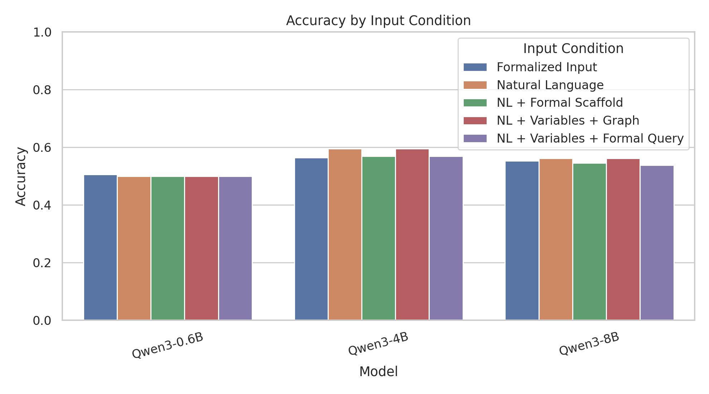
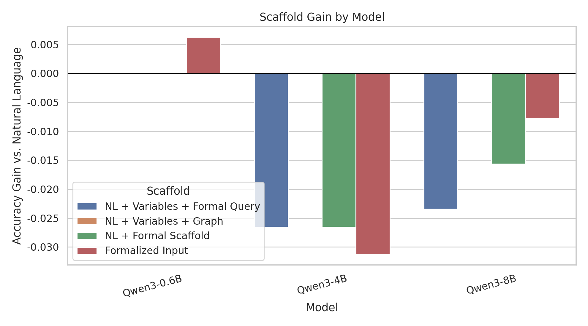
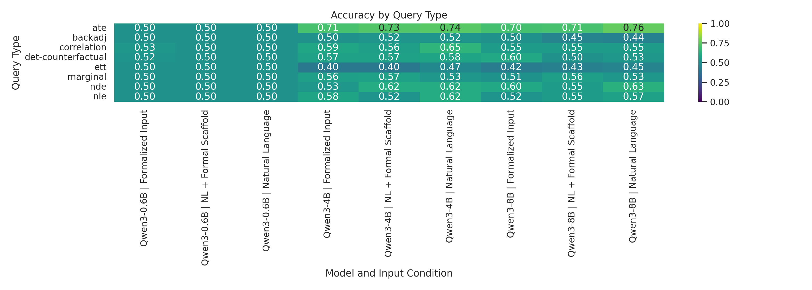
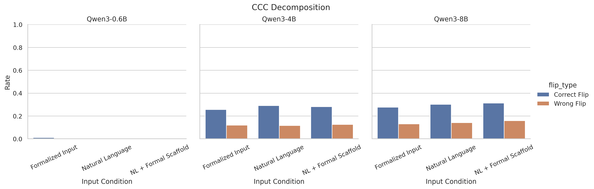
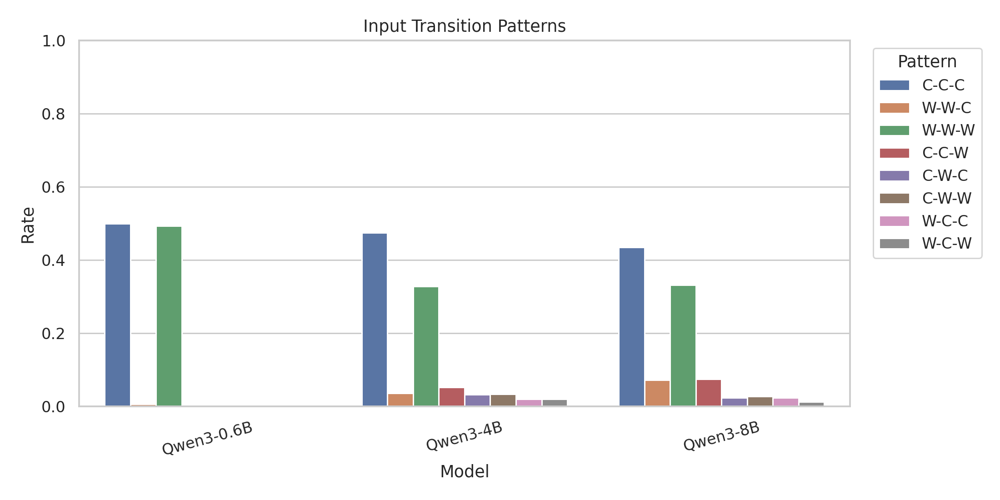
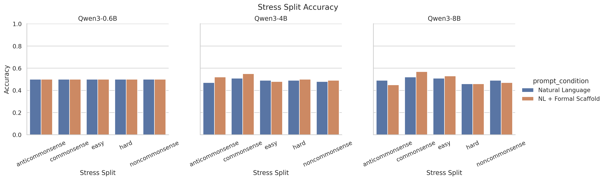
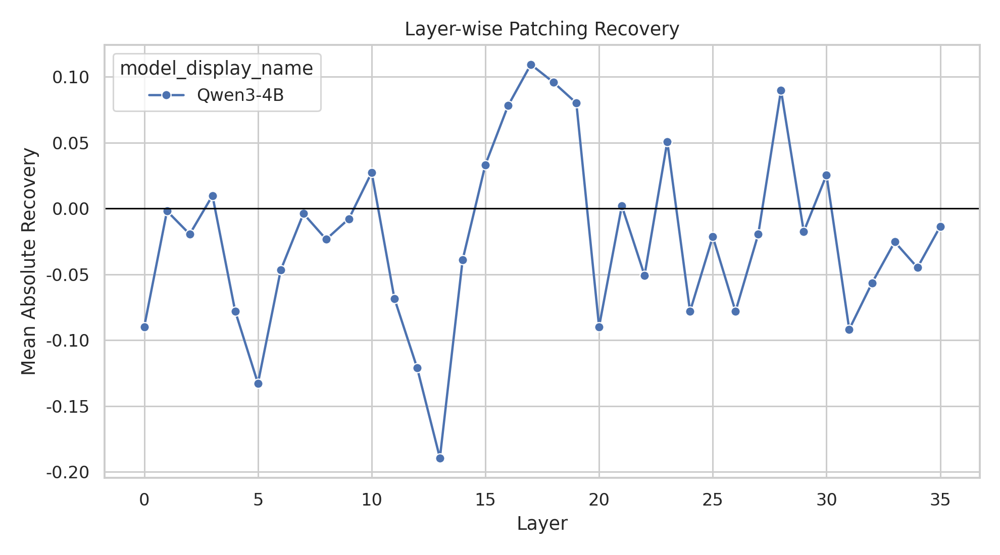

# 实验与结论

## 实验设置

本文使用 CLadder `full_v1.5_default` 构建因果推理评测子集。主评测集包含 640 个样本，覆盖 `marginal`、`correlation`、`ate`、`backadj`、`det-counterfactual`、`ett`、`nie` 和 `nde` 八类 query type。前四类 query type 各抽取 100 个样本，后四类各抽取 60 个样本，并在每个 query type 内保持 yes/no 标签平衡。鲁棒性实验使用 CLadder 的五个 stress split：`commonsense`、`anticommonsense`、`noncommonsense`、`easy` 和 `hard`，每个 split 抽取 100 个样本。

模型包括 Qwen3-0.6B、Qwen3-4B 和 Qwen3-8B。所有模型均从服务器本地权重加载，并采用确定性生成。输出解析优先匹配 `Final answer: yes/no`，其次匹配独立出现的 yes/no；无法解析的输出记为 invalid，并在 parse rate 中单独报告。

输入条件包括五种形式：`nl` 使用原始自然语言题干；`nl_var_query` 在自然语言题干后加入变量映射和 formal query；`nl_var_graph` 加入变量映射和 causal graph；`nl_formal` 同时加入变量映射、causal graph 和 formal query；`formula_only` 保留任务必要的事实条件、变量映射、因果图、formal query 与问题句。所有输入条件均不提供 oracle label 或完整推导步骤。

## 评价指标

给定模型 $m$、输入条件 $c$、样本集合 $D=\{(x_i,y_i)\}_{i=1}^{N}$，其中 $y_i\in\{\mathrm{yes},\mathrm{no}\}$，模型解析后的预测为 $\hat{y}_{i}^{m,c}$。Accuracy 定义为：

$$
\mathrm{Acc}(m,c)=\frac{1}{N}\sum_{i=1}^{N}\mathbf{1}\left[\hat{y}_{i}^{m,c}=y_i\right].
$$

形式脚手架收益定义为某一形式输入条件相对自然语言条件的准确率差：

$$
\Delta_{\mathrm{scaffold}}(m,c)=\mathrm{Acc}(m,c)-\mathrm{Acc}(m,\mathrm{nl}).
$$

严格对照样本对集合定义为：

$$
\mathcal{P}=\{(i,j): s_i=s_j,\ q_i=q_j,\ f_i=f_j,\ y_i\neq y_j\},
$$

其中 $s$、$q$、$f$ 分别表示 story id、query type 和 formal form。Strict Contrast Causal Consistency (CCC) 衡量模型预测是否随 gold label 相反的对照样本发生翻转：

$$
\mathrm{CCC}(m,c)=\frac{1}{|\mathcal{P}|}\sum_{(i,j)\in\mathcal{P}}
\mathbf{1}\left[\hat{y}_{i}^{m,c}\neq \hat{y}_{j}^{m,c}\right].
$$

为避免把错误翻转误解为正确因果判断，本文进一步定义：

$$
\mathrm{CorrectFlip}_{i,j}=
\mathbf{1}\left[\hat{y}_{i}=y_i \land \hat{y}_{j}=y_j\right],
$$

$$
\mathrm{WrongFlip}_{i,j}=
\mathbf{1}\left[\hat{y}_{i}\neq y_i \land \hat{y}_{j}\neq y_j\right].
$$

Strict Correct Contrast Accuracy (SCCA) 与 Signed CCC 分别为：

$$
\mathrm{SCCA}=\frac{1}{|\mathcal{P}|}\sum_{(i,j)\in\mathcal{P}}\mathrm{CorrectFlip}_{i,j},
\qquad
\mathrm{SignedCCC}=\mathrm{CorrectFlipRate}-\mathrm{WrongFlipRate}.
$$

对 `nl` 与 `nl_formal` 的样本级变化，本文统计 rescue 与 harm：

$$
\mathrm{Rescue}=\sum_i \mathbf{1}\left[\hat{y}_{i}^{\mathrm{nl}}\neq y_i \land \hat{y}_{i}^{\mathrm{nl\_formal}}=y_i\right],
$$

$$
\mathrm{Harm}=\sum_i \mathbf{1}\left[\hat{y}_{i}^{\mathrm{nl}}=y_i \land \hat{y}_{i}^{\mathrm{nl\_formal}}\neq y_i\right].
$$

隐藏层分析采用 residual stream patching。令 $M_y(z)$ 表示 gold label 相对另一个 yes/no label 的 logit margin。对第 $\ell$ 层 residual 输出进行 formal-to-natural patch 后，absolute recovery 与 normalized recovery 定义为：

$$
R_{\ell}^{\mathrm{abs}}=
M_y(z_{\mathrm{patched},\ell})-M_y(z_{\mathrm{nl}}),
$$

$$
R_{\ell}^{\mathrm{norm}}=
\frac{M_y(z_{\mathrm{patched},\ell})-M_y(z_{\mathrm{nl}})}
{M_y(z_{\mathrm{nl\_formal}})-M_y(z_{\mathrm{nl}})}.
$$

所有 Accuracy、CCC、SCCA 和条件差异均使用 1000 次 bootstrap 估计 95% 置信区间；`nl` 与形式输入条件之间的配对差异同时报告 McNemar 近似检验。

## 主实验结果

表 1 给出三种主输入条件下的总体结果。Qwen3-0.6B 在多数条件下接近标签平衡基线。Qwen3-4B 在 `nl` 条件下达到最高总体 accuracy 0.5953；`nl_formal` 下降到 0.5687，`formula_only` 为 0.5641。Qwen3-8B 在 `nl` 条件下为 0.5609，在 `nl_formal` 条件下为 0.5453。完整形式脚手架没有带来稳定总体提升。

**表 1. 主输入条件下的总体行为结果**

| model_display_name | prompt_mode  | accuracy | parse_rate | strict_ccc | correct_flip_rate | wrong_flip_rate | scca   | signed_ccc |
| ------------------ | ------------ | -------- | ---------- | ---------- | ----------------- | --------------- | ------ | ---------- |
| Qwen3-0.6B         | formula_only | 0.5062   | 1.0000     | 0.0112     | 0.0112            | 0.0000          | 0.0112 | 0.0112     |
| Qwen3-0.6B         | nl           | 0.5000   | 1.0000     | 0.0000     | 0.0000            | 0.0000          | 0.0000 | 0.0000     |
| Qwen3-0.6B         | nl_formal    | 0.5000   | 1.0000     | 0.0000     | 0.0000            | 0.0000          | 0.0000 | 0.0000     |
| Qwen3-4B           | formula_only | 0.5641   | 1.0000     | 0.3771     | 0.2570            | 0.1201          | 0.2570 | 0.1369     |
| Qwen3-4B           | nl           | 0.5953   | 1.0000     | 0.4078     | 0.2905            | 0.1173          | 0.2905 | 0.1732     |
| Qwen3-4B           | nl_formal    | 0.5687   | 1.0000     | 0.4078     | 0.2821            | 0.1257          | 0.2821 | 0.1564     |
| Qwen3-8B           | formula_only | 0.5531   | 1.0000     | 0.4078     | 0.2765            | 0.1313          | 0.2765 | 0.1453     |
| Qwen3-8B           | nl           | 0.5609   | 1.0000     | 0.4441     | 0.3017            | 0.1425          | 0.3017 | 0.1592     |
| Qwen3-8B           | nl_formal    | 0.5453   | 1.0000     | 0.4721     | 0.3128            | 0.1592          | 0.3128 | 0.1536     |

图 1 展示了不同模型和输入条件的 accuracy。虽然 4B 与 8B 均明显强于 0.6B，但更大的 8B 并未超过 4B。该结果表明，本实验中的主要现象不是单调规模收益，而是模型对形式输入条件的响应不稳定。

## 形式成分消融

表 2 展示了四种形式输入条件相对 `nl` 的 scaffold gain。`nl_var_graph` 在 Qwen3-4B 与 Qwen3-8B 上均与 `nl` 持平，而 `nl_var_query`、`nl_formal` 和 `formula_only` 更容易造成下降。这说明负效应并非来自所有形式信息；causal graph 成分本身没有表现出明显伤害，formal query 或完整形式包装更可能引入额外解析负担。

**表 2. 形式成分消融结果**

| model_display_name | scaffold_mode | nl_accuracy | scaffold_accuracy | scaffold_gain |
| ------------------ | ------------- | ----------- | ----------------- | ------------- |
| Qwen3-0.6B         | nl_var_query  | 0.5000      | 0.5000            | 0.0000        |
| Qwen3-0.6B         | nl_var_graph  | 0.5000      | 0.5000            | 0.0000        |
| Qwen3-0.6B         | nl_formal     | 0.5000      | 0.5000            | 0.0000        |
| Qwen3-0.6B         | formula_only  | 0.5000      | 0.5062            | 0.0062        |
| Qwen3-4B           | nl_var_query  | 0.5953      | 0.5687            | -0.0266       |
| Qwen3-4B           | nl_var_graph  | 0.5953      | 0.5953            | 0.0000        |
| Qwen3-4B           | nl_formal     | 0.5953      | 0.5687            | -0.0266       |
| Qwen3-4B           | formula_only  | 0.5953      | 0.5641            | -0.0312       |
| Qwen3-8B           | nl_var_query  | 0.5609      | 0.5375            | -0.0234       |
| Qwen3-8B           | nl_var_graph  | 0.5609      | 0.5609            | 0.0000        |
| Qwen3-8B           | nl_formal     | 0.5609      | 0.5453            | -0.0156       |
| Qwen3-8B           | formula_only  | 0.5609      | 0.5531            | -0.0078       |

## 细粒度任务分析

表 3 给出 Qwen3-4B 与 Qwen3-8B 在不同 query type 上的 accuracy。ATE 是两个较大模型表现最好的类型；Qwen3-4B 与 Qwen3-8B 在 `nl` 条件下分别达到 0.740 与 0.760。相比之下，`backadj`、`ett` 以及部分 mediation/counterfactual 类问题更弱。形式脚手架对 `marginal` 有小幅正效应，但对 `correlation`、`nie`、`nde` 和 `ett` 等类型常出现负效应。

**表 3. Query type 维度的 accuracy**

| query_type         | Qwen3-4B_nl | Qwen3-4B_nl_formal | Qwen3-8B_nl | Qwen3-8B_nl_formal |
| ------------------ | ----------- | ------------------ | ----------- | ------------------ |
| ate                | 0.740       | 0.730              | 0.760       | 0.710              |
| backadj            | 0.520       | 0.520              | 0.440       | 0.450              |
| correlation        | 0.650       | 0.560              | 0.550       | 0.550              |
| det-counterfactual | 0.583       | 0.567              | 0.533       | 0.500              |
| ett                | 0.467       | 0.400              | 0.450       | 0.433              |
| marginal           | 0.530       | 0.570              | 0.530       | 0.560              |
| nde                | 0.617       | 0.617              | 0.633       | 0.550              |
| nie                | 0.617       | 0.517              | 0.567       | 0.550              |

图 3 的 heatmap 更直观地显示了错误分布并不均匀。任务类型差异使得单一总体 accuracy 容易掩盖模型的具体失败位置，因此后续分析不应只依赖平均值。

## CCC 正误分解

CCC 衡量模型是否随严格对照发生预测翻转，但预测翻转本身不保证方向正确。表 1 中 Qwen3-8B 的 `nl_formal` CCC 为 0.4721，高于其 `nl` 条件的 0.4441；但对应的 wrong flip rate 也从 0.1425 增至 0.1592，signed CCC 反而从 0.1592 降至 0.1536。也就是说，形式脚手架提高了部分对照敏感性，但并未相应提高净正确翻转。

一个更强的负例来自 Qwen3-8B 在 `det-counterfactual` 的 `nl_formal` 条件下：该子类 CCC 为 1.0000，但 correct flip rate 为 0，wrong flip rate 为 1.0000。该现象表明，模型可能确实捕捉到了对照样本之间存在差异，但将差异映射到了错误答案方向。因此，CCC 必须与 correct flip、wrong flip、SCCA 和 signed CCC 一起报告。

## Rescue/Harm 与输入迁移轨迹

表 4 展示了 `nl` 到 `nl_formal` 的样本级变化。Qwen3-4B 在形式脚手架下救回 26 个自然语言错误样本，但同时破坏 43 个自然语言正确样本；Qwen3-8B 救回 23 个样本，同时破坏 33 个样本。形式脚手架不是单向修复机制，而是在样本层面同时产生 rescue 与 harm。

**表 4. Rescue/Harm 分析**

| model_display_name | rescue_count | harm_count | rescue_rate_over_nl_failures | harm_rate_over_nl_successes | net_rescue_rate |
| ------------------ | ------------ | ---------- | ---------------------------- | --------------------------- | --------------- |
| Qwen3-0.6B         | 0            | 0          | 0.0000                       | 0.0000                      | 0.0000          |
| Qwen3-4B           | 26           | 43         | 0.1004                       | 0.1129                      | -0.0266         |
| Qwen3-8B           | 23           | 33         | 0.0819                       | 0.0919                      | -0.0156         |

输入迁移轨迹进一步说明这种不稳定性。Qwen3-4B 的 C-C-C 比例为 47.5%，W-W-W 为 32.8%；Qwen3-8B 的 C-C-C 为 43.4%，W-W-W 为 33.1%。除稳定正确和稳定错误外，C-W-W、C-W-C、W-W-C 等轨迹也占有可见比例，说明形式输入会诱发答案迁移，但迁移方向并不稳定。

## Stress Split 鲁棒性

表 5 汇总了 stress split 上的表现。Qwen3-4B 的 `nl_formal` 平均 stress accuracy 从 0.488 提高到 0.508，但 worst split 仅为 0.480，跨 split 标准差从 0.013 增至 0.025。Qwen3-8B 的 `nl_formal` 平均 accuracy 与 `nl` 接近，但 worst split 从 0.460 降至 0.450，标准差从 0.021 增至 0.046。

**表 5. Stress split 鲁棒性结果**

| model_display_name | prompt_mode | commonsense_accuracy | anticommonsense_accuracy | noncommonsense_accuracy | easy_accuracy | hard_accuracy | mean_accuracy | worst_split_accuracy | std_across_splits |
| ------------------ | ----------- | -------------------- | ------------------------ | ----------------------- | ------------- | ------------- | ------------- | -------------------- | ----------------- |
| Qwen3-4B           | nl          | 0.510                | 0.470                    | 0.480                   | 0.490         | 0.490         | 0.488         | 0.470                | 0.013             |
| Qwen3-4B           | nl_formal   | 0.550                | 0.520                    | 0.490                   | 0.480         | 0.500         | 0.508         | 0.480                | 0.025             |
| Qwen3-8B           | nl          | 0.520                | 0.490                    | 0.490                   | 0.510         | 0.460         | 0.494         | 0.460                | 0.021             |
| Qwen3-8B           | nl_formal   | 0.570                | 0.450                    | 0.470                   | 0.530         | 0.460         | 0.496         | 0.450                | 0.046             |

该结果说明，形式脚手架在部分 split 上可能改善平均值，但没有稳定提升 worst-case performance，并且可能放大跨 split 方差。因此，形式结构提示在鲁棒性层面仍然不可靠。

## 隐藏层 Patching 分析

Patching 实验在 Qwen3-4B 上进行，共选择 16 个 `nl` 错误而 `nl_formal` 正确的样本，扫描 36 层 residual stream，得到 576 条 matched patching 结果。Random patch control 使用另一样本的 `nl_formal` residual 作为对照，也得到 576 条结果。

**表 6. Matched patching 与 random control**

| patch_condition      | n_samples | mean_absolute_recovery | median_absolute_recovery | max_absolute_recovery | positive_recovery_rate | mean_normalized_recovery |
| -------------------- | --------- | ---------------------- | ------------------------ | --------------------- | ---------------------- | ------------------------ |
| matched              | 16        | -0.0225                | 0.0000                   | 3.7188                | 0.4618                 | 0.5157                   |
| random               | 16        | -0.0610                | -0.0312                  | 2.9375                | 0.4670                 | 0.3573                   |
| matched_minus_random | 16        | 0.0385                 | 0.0312                   | 2.1250                | 0.5069                 |                          |

Matched patching 的 mean absolute recovery 为 -0.0225，整体均值接近零；但最大恢复量达到 3.7188，mean normalized recovery 为 0.5157。Random control 的 mean absolute recovery 为 -0.0610，matched-minus-random 的平均差为 0.0385。这一结果不支持强机制宣称，但可以作为探索性证据：匹配形式输入 residual 在部分层和样本上携带可转移的答案方向信号，不过该信号并未稳定转化为总体行为收益。

## 结论

本文实验表明，Qwen3 系列模型在 CLadder 因果推理任务上的困难不是单一的总体准确率不足，而表现为多层面的结构性不稳定。首先，错误在 query type 和 rung 上分布不均，ATE 相对容易，而 `backadj`、`ett` 和部分高阶 mediation/counterfactual 任务更容易失败。其次，严格对照一致性必须与正确性分开解释；较高的 CCC 可能由错误翻转贡献，不能直接作为正确因果推理能力的证据。第三，形式脚手架并不是稳定增益机制，它既能救回部分自然语言错误样本，也会破坏原本正确的样本。

形式成分消融进一步说明，不同形式信息的影响不同。Causal graph 成分在 Qwen3-4B 和 Qwen3-8B 上基本不降低总体 accuracy，而 formal query 或完整形式包装更容易造成性能下降。这提示模型并非完全无法利用结构信息，但当前形式查询表达可能引入了额外的符号解析负担，使其难以稳定转化为正确答案。

隐藏层 patching 提供了谨慎的机制证据。Matched patching 相比 random control 有小幅平均优势，并在个别层和样本上出现明显恢复，但总体恢复不稳定。因此，本文不将其解释为完整因果回路，而将其视为形式输入在局部表示中包含可转移答案方向信号的探索性证据。

本文仍有三点局限。第一，实验只覆盖 CLadder 一个数据集，不能代表所有真实因果问答场景。第二，模型均来自 Qwen3 同一家族，结论不能直接外推到跨架构比较。第三，patching 只在 Qwen3-4B 的 16 个样本上进行，适合作为机制探索而非强机制证明。后续工作可以扩展到更多因果基准、更多形式表示方式和更系统的表示层干预分析。
