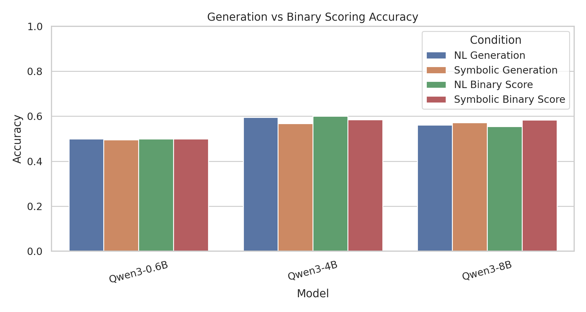
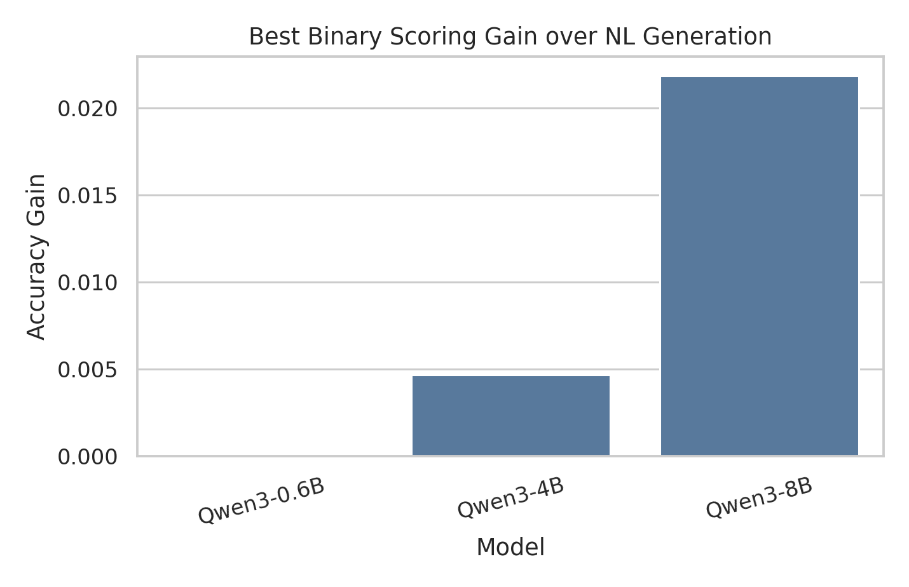

# 实验与结论

## 实验设置

本文在 CLadder `full_v1.5_default` 上构建平衡评测子集，共 640 个主评测样本。样本覆盖 `marginal`、`correlation`、`ate`、`backadj`、`det-counterfactual`、`ett`、`nie` 与 `nde` 八类查询，其中前四类各 100 个样本，后三阶反事实与中介类查询各 60 个样本，并在每个 query type 内保持 `yes/no` 标签平衡。评测模型为 Qwen3-0.6B、Qwen3-4B 与 Qwen3-8B，均使用服务器本地权重。所有行为实验使用贪心解码或受约束二分类打分，不引入人工修补答案。

输入条件分为三组。第一组为生成式基线，包括自然语言题干 `nl` 与加入变量、图结构和形式查询的 `nl_formal`。第二组为符号分解辅助输入 `symbolic_solver_concise`，该输入保留自然语言问题，并加入变量映射、因果图、形式查询、公式模板和概率事实，同时删除最终数值比较与最终答案。第三组为二分类似然打分条件，对 `yes` 和 `no` 两个候选答案进行条件 log-likelihood 比较，分别得到 `nl_binary_score`、`nl_formal_binary_score` 与 `symbolic_solver_concise_binary_score`。

## 指标定义

给定模型 $m$、输入条件 $c$ 和样本集合 $D=\{(x_i,y_i)\}_{i=1}^{N}$，其中 $y_i\in\{\mathrm{yes},\mathrm{no}\}$。模型解析后的预测为 $\hat{y}_i^{(m,c)}$。准确率定义为：

$$
\mathrm{Acc}(m,c)=\frac{1}{N}\sum_{i=1}^N \mathbf{1}\left[\hat{y}_i^{(m,c)}=y_i\right].
$$

形式脚手架或干预条件相对自然语言条件的收益定义为：

$$
\Delta_{\mathrm{Acc}}(m,c)=\mathrm{Acc}(m,c)-\mathrm{Acc}(m,\mathrm{nl}).
$$

严格对照 pair 集合定义为：

$$
\mathcal{P}=\{(i,j):s_i=s_j,\ q_i=q_j,\ f_i=f_j,\ y_i\ne y_j\},
$$

其中 $s$、$q$ 与 $f$ 分别表示 story id、query type 和 formal form。Strict Contrast Causal Consistency 衡量模型预测是否随 gold label 相反的对照样本发生翻转：

$$
\mathrm{CCC}(m,c)=\frac{1}{|\mathcal{P}|}\sum_{(i,j)\in\mathcal{P}}\mathbf{1}\left[\hat{y}_i^{(m,c)}\ne \hat{y}_j^{(m,c)}\right].
$$

为区分正确翻转和错误翻转，定义：

$$
\mathrm{CF}(m,c)=\frac{1}{|\mathcal{P}|}\sum_{(i,j)\in\mathcal{P}}\mathbf{1}\left[\hat{y}_i^{(m,c)}=y_i \land \hat{y}_j^{(m,c)}=y_j\right],
$$

$$
\mathrm{WF}(m,c)=\frac{1}{|\mathcal{P}|}\sum_{(i,j)\in\mathcal{P}}\mathbf{1}\left[\hat{y}_i^{(m,c)}\ne y_i \land \hat{y}_j^{(m,c)}\ne y_j\right].
$$

本文将 $\mathrm{SCCA}=\mathrm{CF}$，即 pair 内两个样本同时回答正确的严格对照准确率。二分类似然打分使用下式选择答案：

$$
\hat{y}=\arg\max_{a\in\{\mathrm{yes},\mathrm{no}\}}\log P_\theta\left(a\mid p,\ \text{``Final answer:''}\right),
$$

其中 $p$ 为对应输入条件下的提示文本。该解码方式把输出空间限制为二元答案集合，避免自由生成造成的格式漂移。

## 主结果

表 1 给出生成式输入、符号分解辅助输入与二分类似然打分输入的总体指标。Qwen3-0.6B 在所有条件下接近随机水平，说明该规模模型难以利用 CLadder 中的形式结构。Qwen3-4B 的最高总体准确率来自 `nl_binary_score`，达到 0.6000，略高于自然语言生成式基线 0.5953。Qwen3-8B 的最高总体准确率来自 `symbolic_solver_concise_binary_score`，达到 0.5828，高于自然语言生成式基线 0.5609。

**表 1. 主评测条件下的总体指标**

| model_display_name   | prompt_condition                     |   n |   accuracy |   parse_rate |   strict_ccc |   correct_flip_rate |   wrong_flip_rate |   scca |   signed_ccc |
|:---------------------|:-------------------------------------|----:|-----------:|-------------:|-------------:|--------------------:|------------------:|-------:|-------------:|
| Qwen3-0.6B           | Natural Language                     | 640 |     0.5    |       1      |       0      |              0      |            0      | 0      |       0      |
| Qwen3-0.6B           | NL + Formal Scaffold                 | 640 |     0.5    |       1      |       0      |              0      |            0      | 0      |       0      |
| Qwen3-0.6B           | Concise Symbolic Solver              | 640 |     0.4953 |       0.9875 |       0      |              0      |            0      | 0      |       0      |
| Qwen3-0.6B           | NL Binary Score                      | 640 |     0.5    |       1      |       0      |              0      |            0      | 0      |       0      |
| Qwen3-0.6B           | Formal Scaffold Binary Score         | 640 |     0.5    |       1      |       0      |              0      |            0      | 0      |       0      |
| Qwen3-0.6B           | Concise Symbolic Solver Binary Score | 640 |     0.5    |       1      |       0      |              0      |            0      | 0      |       0      |
| Qwen3-4B             | Natural Language                     | 640 |     0.5953 |       1      |       0.4078 |              0.2905 |            0.1173 | 0.2905 |       0.1732 |
| Qwen3-4B             | NL + Formal Scaffold                 | 640 |     0.5688 |       1      |       0.4078 |              0.2821 |            0.1257 | 0.2821 |       0.1564 |
| Qwen3-4B             | Concise Symbolic Solver              | 640 |     0.5672 |       0.9719 |       0.4645 |              0.3521 |            0.1124 | 0.3521 |       0.2396 |
| Qwen3-4B             | NL Binary Score                      | 640 |     0.6    |       1      |       0.405  |              0.3017 |            0.1034 | 0.3017 |       0.1983 |
| Qwen3-4B             | Formal Scaffold Binary Score         | 640 |     0.5688 |       1      |       0.3911 |              0.2709 |            0.1201 | 0.2709 |       0.1508 |
| Qwen3-4B             | Concise Symbolic Solver Binary Score | 640 |     0.5844 |       1      |       0.4693 |              0.338  |            0.1313 | 0.338  |       0.2067 |
| Qwen3-8B             | Natural Language                     | 640 |     0.5609 |       1      |       0.4441 |              0.3017 |            0.1425 | 0.3017 |       0.1592 |
| Qwen3-8B             | NL + Formal Scaffold                 | 640 |     0.5453 |       1      |       0.4721 |              0.3128 |            0.1592 | 0.3128 |       0.1536 |
| Qwen3-8B             | Concise Symbolic Solver              | 640 |     0.5719 |       0.9656 |       0.5062 |              0.3789 |            0.1273 | 0.3789 |       0.2516 |
| Qwen3-8B             | NL Binary Score                      | 640 |     0.5547 |       1      |       0.4441 |              0.3045 |            0.1397 | 0.3045 |       0.1648 |
| Qwen3-8B             | Formal Scaffold Binary Score         | 640 |     0.5359 |       1      |       0.4609 |              0.2989 |            0.162  | 0.2989 |       0.1369 |
| Qwen3-8B             | Concise Symbolic Solver Binary Score | 640 |     0.5828 |       1      |       0.4218 |              0.2849 |            0.1369 | 0.2849 |       0.148  |

图 1 与图 2 展示符号分解辅助输入的总体准确率和 query type 级收益。图 3 与图 4 展示生成式解码与二分类似然打分的准确率差异。

## 干预效果分析

表 2 汇总自然语言生成和符号分解生成在准确率与严格对照指标上的差异。符号分解输入更稳定的作用体现在较大模型的对照级指标上。Qwen3-8B 在 `symbolic_solver_concise` 下的 SCCA 从 0.3017 提升到 0.3789，CCC 从 0.4441 提升到 0.5062。结合二分类似然打分后，Qwen3-8B 的总体准确率进一步达到 0.5828。Qwen3-4B 的符号分解生成没有提升总体准确率，但 SCCA 从 0.2905 提升到 0.3521，说明该输入改善了一部分严格对照 pair 的方向正确性。

**表 2. 符号分解辅助输入的准确率与严格对照指标**

| model_display_name   |   nl_accuracy |   symbolic_solver_accuracy |   gain_vs_nl |   nl_strict_ccc |   symbolic_solver_strict_ccc |   nl_scca |   symbolic_solver_scca |
|:---------------------|--------------:|---------------------------:|-------------:|----------------:|-----------------------------:|----------:|-----------------------:|
| Qwen3-0.6B           |        0.5    |                     0.4953 |      -0.0047 |          0      |                       0      |    0      |                 0      |
| Qwen3-4B             |        0.5953 |                     0.5672 |      -0.0281 |          0.4078 |                       0.4645 |    0.2905 |                 0.3521 |
| Qwen3-8B             |        0.5609 |                     0.5719 |       0.0109 |          0.4441 |                       0.5062 |    0.3017 |                 0.3789 |

**表 3. 二分类似然打分的总体比较**

| model_display_name   |   nl_generation |   nl_formal_generation |   symbolic_generation |   nl_binary_score |   nl_formal_binary_score |   symbolic_binary_score |   best_binary_gain_vs_nl |
|:---------------------|----------------:|-----------------------:|----------------------:|------------------:|-------------------------:|------------------------:|-------------------------:|
| Qwen3-0.6B           |          0.5    |                 0.5    |                0.4953 |            0.5    |                   0.5    |                  0.5    |                   0      |
| Qwen3-4B             |          0.5953 |                 0.5688 |                0.5672 |            0.6    |                   0.5688 |                  0.5844 |                   0.0047 |
| Qwen3-8B             |          0.5609 |                 0.5453 |                0.5719 |            0.5547 |                   0.5359 |                  0.5828 |                   0.0219 |

配对 bootstrap 的结果见表 4。Qwen3-8B 的 `symbolic_solver_concise_binary_score` 相对自然语言生成式基线的平均增益为 0.0219；在 640 个样本上，95% bootstrap 区间仍包含 0，因此本文将其表述为正向趋势，而不是统计显著提升。该结果说明，符号分解与受约束解码的组合比自由生成更接近可用的因果问答流程。

**表 4. 相对自然语言生成式基线的配对 bootstrap 增益**

| model    | condition_a                          | condition_b   |   n |   acc_a |   acc_b |   paired_gain |   ci_low |   ci_high |   p_gain_le_0 |
|:---------|:-------------------------------------|:--------------|----:|--------:|--------:|--------------:|---------:|----------:|--------------:|
| qwen3_4b | nl_binary_score                      | nl            | 640 |  0.6    |  0.5953 |        0.0047 |  -0.0031 |    0.0125 |        0.1663 |
| qwen3_4b | symbolic_solver_concise_binary_score | nl            | 640 |  0.5844 |  0.5953 |       -0.0109 |  -0.0453 |    0.0234 |        0.7526 |
| qwen3_8b | symbolic_solver_concise              | nl            | 640 |  0.5719 |  0.5609 |        0.0109 |  -0.0297 |    0.0531 |        0.3122 |
| qwen3_8b | symbolic_solver_concise_binary_score | nl            | 640 |  0.5828 |  0.5609 |        0.0219 |  -0.0109 |    0.0547 |        0.103  |

## Query Type 细分

表 5 展示 Qwen3-4B 与 Qwen3-8B 在不同 query type 上的结果。Qwen3-8B 的符号二分类打分在 `ate`、`nde`、`nie`、`marginal` 与 `backadj` 上超过自然语言生成式基线，其中 `nde` 从 0.6333 提升到 0.7667，`nie` 从 0.5667 提升到 0.6667。与此同时，`ett` 和 `det-counterfactual` 仍然较弱，说明当前符号分解对中介效应和部分平均处理效应形式更有效，而对 treatment-on-treated 形式仍未形成稳定收益。

**表 5. Query type 级准确率**

| model_display_name   | query_type         |   nl_generation |   symbolic_generation |   nl_binary_score |   symbolic_binary_score |
|:---------------------|:-------------------|----------------:|----------------------:|------------------:|------------------------:|
| Qwen3-4B             | ate                |          0.74   |                0.76   |            0.75   |                  0.78   |
| Qwen3-4B             | backadj            |          0.52   |                0.56   |            0.52   |                  0.54   |
| Qwen3-4B             | correlation        |          0.65   |                0.6    |            0.65   |                  0.62   |
| Qwen3-4B             | det-counterfactual |          0.5833 |                0.5333 |            0.5833 |                  0.5333 |
| Qwen3-4B             | ett                |          0.4667 |                0.3667 |            0.4833 |                  0.45   |
| Qwen3-4B             | marginal           |          0.53   |                0.53   |            0.54   |                  0.53   |
| Qwen3-4B             | nde                |          0.6167 |                0.5167 |            0.6333 |                  0.4833 |
| Qwen3-4B             | nie                |          0.6167 |                0.55   |            0.6    |                  0.65   |
| Qwen3-8B             | ate                |          0.76   |                0.82   |            0.76   |                  0.8    |
| Qwen3-8B             | backadj            |          0.44   |                0.46   |            0.44   |                  0.48   |
| Qwen3-8B             | correlation        |          0.55   |                0.5    |            0.55   |                  0.53   |
| Qwen3-8B             | det-counterfactual |          0.5333 |                0.5833 |            0.4833 |                  0.5    |
| Qwen3-8B             | ett                |          0.45   |                0.3333 |            0.4333 |                  0.35   |
| Qwen3-8B             | marginal           |          0.53   |                0.5    |            0.52   |                  0.55   |
| Qwen3-8B             | nde                |          0.6333 |                0.6833 |            0.6667 |                  0.7667 |
| Qwen3-8B             | nie                |          0.5667 |                0.7    |            0.55   |                  0.6667 |

## 白盒 Patching 结果

白盒实验在 Qwen3-4B 上进行。实验选择自然语言条件回答错误、形式脚手架条件回答正确的样本，将形式输入在每层最后 token 的 residual stream patch 到自然语言输入中，并比较 gold-label logit margin 的恢复。该实验只用于机制探索，不把局部恢复解释为完整因果回路。

**表 6. Formal-to-natural residual stream patching 总体结果**

| model    | model_display_name   | method                          |   n_rows |   n_samples |   mean_absolute_recovery |   max_absolute_recovery |   mean_normalized_recovery |
|:---------|:---------------------|:--------------------------------|---------:|------------:|-------------------------:|------------------------:|---------------------------:|
| qwen3_4b | Qwen3-4B             | hf_last_token_formal_to_natural |      576 |          16 |                  -0.0225 |                  3.7188 |                     0.5157 |

**表 7. Matched patch 与 random patch control**

| model    | model_display_name   | patch_condition      |   n_rows |   n_samples |   mean_absolute_recovery |   median_absolute_recovery |   max_absolute_recovery |   positive_recovery_rate |   mean_normalized_recovery |
|:---------|:---------------------|:---------------------|---------:|------------:|-------------------------:|---------------------------:|------------------------:|-------------------------:|---------------------------:|
| qwen3_4b | Qwen3-4B             | matched              |      576 |          16 |                  -0.0225 |                     0      |                  3.7188 |                   0.4618 |                     0.5157 |
| qwen3_4b | Qwen3-4B             | random               |      576 |          16 |                  -0.061  |                    -0.0312 |                  2.9375 |                   0.467  |                     0.3573 |
| qwen3_4b | Qwen3-4B             | matched_minus_random |      576 |          16 |                   0.0385 |                     0.0312 |                  2.125  |                   0.5069 |                   nan      |

**表 8. 平均 recovery 最高的五个层**

| model    | model_display_name   |   layer |   mean_recovery |   median_recovery |   max_recovery |   positive_recovery_rate |   mean_normalized_recovery |
|:---------|:---------------------|--------:|----------------:|------------------:|---------------:|-------------------------:|---------------------------:|
| qwen3_4b | Qwen3-4B             |      17 |          0.1094 |            0.125  |         2.125  |                   0.625  |                     0.492  |
| qwen3_4b | Qwen3-4B             |      18 |          0.0957 |            0.0938 |         2.1562 |                   0.5    |                     0.6189 |
| qwen3_4b | Qwen3-4B             |      28 |          0.0898 |           -0.0312 |         2      |                   0.5    |                     0.6074 |
| qwen3_4b | Qwen3-4B             |      19 |          0.0801 |            0.0938 |         2.3438 |                   0.5625 |                     0.547  |
| qwen3_4b | Qwen3-4B             |      16 |          0.0781 |            0.0781 |         1.75   |                   0.5625 |                     0.3198 |

Matched patch 的 mean normalized recovery 为 0.5157，高于 random control 的 0.3573；matched-minus-random 的平均 absolute recovery 为 0.0385。逐层结果显示第 16 至 19 层及第 28 层存在较高平均 recovery。这说明形式输入中的部分表示能够在残差流中转移到自然语言条件，但这种转移并不稳定，也不能单独解释所有行为收益。

## 结论

实验表明，CLadder 上的困难不只是模型规模不足，也包括输入表示和解码方式之间的不匹配。直接加入变量、图结构和形式查询并不会自动提升准确率；形式信息需要被组织为可执行的符号分解，并配合受约束的 yes/no 决策过程，才可能转化为行为收益。

在三种模型中，Qwen3-0.6B 基本无法利用新增结构信息。Qwen3-4B 的最佳总体准确率来自自然语言条件下的二分类似然打分，达到 0.6000；其符号分解生成虽然降低总体准确率，但把 SCCA 从 0.2905 提升到 0.3521。Qwen3-8B 对干预更敏感：符号分解生成将 SCCA 从 0.3017 提升到 0.3789，符号分解加二分类似然打分将准确率从 0.5609 提升到 0.5828。该组合构成本文最主要的正向结果。

从任务类型看，收益集中在 `ate`、`nde`、`nie` 等估计量较明确的查询上，而 `ett`、`correlation` 和部分反事实问题仍然不稳定。这说明符号分解辅助并非通用增强，而是一种有条件有效的因果问答接口：当问题可以被稳定映射到形式估计量和概率事实时，模型更容易给出正确方向；当查询语义需要更复杂的反事实解释或问题措辞与估计量方向存在张力时，模型仍会失败。

本文的实验规模仍然有限。配对 bootstrap 显示主要准确率增益的置信区间包含 0，因此结论应表述为可复现的正向趋势与机制线索，而非强显著性结论。后续工作应扩大样本规模，并将符号分解从数据集自带 reasoning 字段替换为独立的自动解析器，以检验该方法在非模板化因果文本上的泛化能力。
