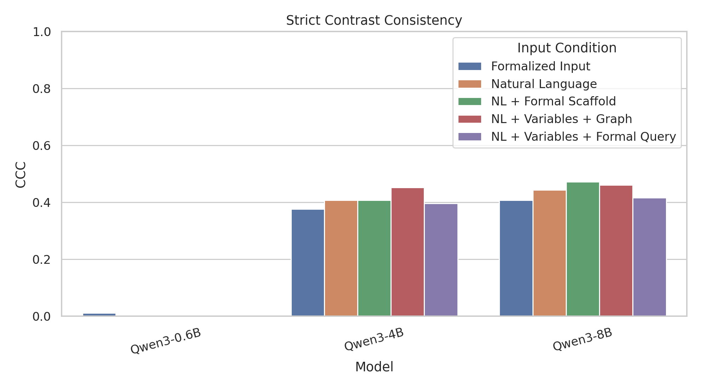
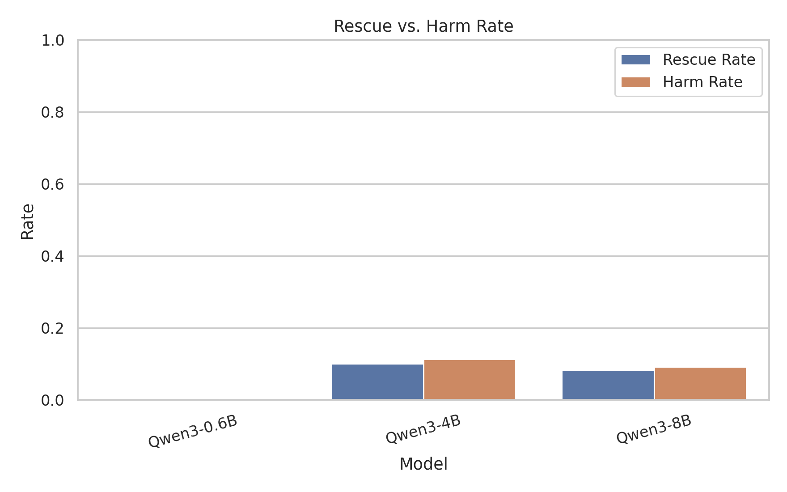

# MLISE 2026 Qwen 因果推理最终实验报告

## 1. 实验概述

- 实验时间：2026-05-13 09:16:54
- run_id：`final_20260513_090357`
- 样本模式：`formal`
- 实验目标：在 CLadder 因果推理任务上评估 Qwen3 系列模型对自然语言题干、形式结构提示、严格对照样本和隐藏层表示的响应。
- 图表标题、坐标轴、图例均使用英文，便于后续直接进入英文会议论文。
- 本 Markdown 报告使用中文。

## 2. 服务器环境

- 记录时间：`2026-05-13 09:16:54`
- 主机名：`ubuntu`
- 系统：`Linux-6.8.0-111-generic-x86_64-with-glibc2.39`
- Python：`3.11.15 (main, Mar 11 2026, 17:20:07) [GCC 14.3.0]`
- PyTorch：`2.11.0+cu130`
- CUDA可用：`True`
- CUDA_VISIBLE_DEVICES：``
- CUDA版本：`13.0`
- GPU数量：`8`
- GPU列表：`['NVIDIA A100 80GB PCIe', 'NVIDIA A100 80GB PCIe', 'NVIDIA A100 80GB PCIe', 'NVIDIA A100 80GB PCIe', 'NVIDIA A100 80GB PCIe', 'NVIDIA A100 80GB PCIe', 'NVIDIA A100 80GB PCIe', 'NVIDIA A100 80GB PCIe']`
- Transformers：`5.8.1`

## 3. 数据集与输入条件

- 主数据集：`/data/kongyb/ipm/datasets/cladder/data/full_v1.5_default.csv`
- 主实验样本：按 query type 分层抽样，并在每个 query type 内保持 yes/no 平衡。
- stress splits：`commonsense, anticommonsense, noncommonsense, easy, hard`。
- 主输入条件：`nl`、`nl_formal`、`formula_only`。
- 消融输入条件：`nl_var_query`、`nl_var_graph`。
- 解析规则：优先解析 `Final answer: yes/no`，其次解析独立 yes/no，失败记为 invalid。

## 4. 模型路径

- Qwen3-0.6B：`/data/LLM/Qwen/Qwen3-0___6B`
- Qwen3-4B：`/data/LLM/Qwen/Qwen3-4B`
- Qwen3-8B：`/data/LLM/Qwen/Qwen3-8B`

## 5. 指标定义

- `Accuracy`：单题预测是否等于 CLadder oracle label。
- `Strict Contrast Causal Consistency (CCC)`：同一 story、query type 和 formal form 下，gold 相反的 pair 是否也得到相反预测。
- `Correct Flip / Wrong Flip / SCCA`：将 CCC 拆成正确翻转、错误翻转和严格正确对照准确率。
- `Scaffold Gain`：各形式输入条件相对 `nl` 的 accuracy 增量。
- `Rescue / Harm`：`nl` 错而 `nl_formal` 对记为 rescue；`nl` 对而 `nl_formal` 错记为 harm。
- `Transition Pattern`：统计 `nl -> nl_formal -> formula_only` 的 C/W 正确性轨迹。
- `Stress Robustness`：报告 split 级 accuracy、worst split 和跨 split 方差。
- `Formal-to-Natural Patching Recovery`：把 `nl_formal` 条件的 residual 输出 patch 到 `nl` 条件后，gold-label logit margin 的变化。

## 6. 聚合主结果

| model      | model_display_name   | diagnostic_source   | dataset_variant   | prompt_mode   | prompt_condition              |   n |   accuracy |   parse_rate |   invalid_rate |   latency_sec |   strict_ccc |   correct_flip_rate |   wrong_flip_rate |   invariant_yes_rate |   invariant_no_rate |      scca |   signed_ccc |   invalid_pair_rate |
|:-----------|:---------------------|:--------------------|:------------------|:--------------|:------------------------------|----:|-----------:|-------------:|---------------:|--------------:|-------------:|--------------------:|------------------:|---------------------:|--------------------:|----------:|-------------:|--------------------:|
| qwen3_0_6b | Qwen3-0.6B           | main                | main              | formula_only  | Formalized Input              | 640 |   0.50625  |     1        |      0         |     0.0118315 |    0.0111732 |           0.0111732 |          0        |             0.988827 |            0        | 0.0111732 |    0.0111732 |                   0 |
| qwen3_0_6b | Qwen3-0.6B           | main                | main              | nl            | Natural Language              | 640 |   0.5      |     1        |      0         |     0.0109315 |    0         |           0         |          0        |             1        |            0        | 0         |    0         |                   0 |
| qwen3_0_6b | Qwen3-0.6B           | main                | main              | nl_formal     | NL + Formal Scaffold          | 640 |   0.5      |     1        |      0         |     0.0112851 |    0         |           0         |          0        |             1        |            0        | 0         |    0         |                   0 |
| qwen3_0_6b | Qwen3-0.6B           | main                | main              | nl_var_graph  | NL + Variables + Graph        | 640 |   0.5      |     1        |      0         |     0.0104695 |    0         |           0         |          0        |             1        |            0        | 0         |    0         |                   0 |
| qwen3_0_6b | Qwen3-0.6B           | main                | main              | nl_var_query  | NL + Variables + Formal Query | 640 |   0.5      |     0.992188 |      0.0078125 |     0.0127295 |    0         |           0         |          0        |             1        |            0        | 0         |    0         |                   0 |
| qwen3_4b   | Qwen3-4B             | main                | main              | formula_only  | Formalized Input              | 640 |   0.564063 |     1        |      0         |     0.0343917 |    0.377095  |           0.256983  |          0.120112 |             0.23743  |            0.385475 | 0.256983  |    0.136872  |                   0 |
| qwen3_4b   | Qwen3-4B             | main                | main              | nl            | Natural Language              | 640 |   0.595313 |     1        |      0         |     0.0291895 |    0.407821  |           0.290503  |          0.117318 |             0.209497 |            0.382682 | 0.290503  |    0.173184  |                   0 |
| qwen3_4b   | Qwen3-4B             | main                | main              | nl_formal     | NL + Formal Scaffold          | 640 |   0.56875  |     1        |      0         |     0.033753  |    0.407821  |           0.282123  |          0.125698 |             0.192737 |            0.399441 | 0.282123  |    0.156425  |                   0 |
| qwen3_4b   | Qwen3-4B             | main                | main              | nl_var_graph  | NL + Variables + Graph        | 640 |   0.595313 |     1        |      0         |     0.0320955 |    0.452514  |           0.346369  |          0.106145 |             0.231844 |            0.315642 | 0.346369  |    0.240223  |                   0 |
| qwen3_4b   | Qwen3-4B             | main                | main              | nl_var_query  | NL + Variables + Formal Query | 640 |   0.56875  |     1        |      0         |     0.0328662 |    0.396648  |           0.27095   |          0.125698 |             0.178771 |            0.424581 | 0.27095   |    0.145251  |                   0 |
| qwen3_8b   | Qwen3-8B             | main                | main              | formula_only  | Formalized Input              | 640 |   0.553125 |     1        |      0         |     0.0622966 |    0.407821  |           0.276536  |          0.131285 |             0.298883 |            0.293296 | 0.276536  |    0.145251  |                   0 |
| qwen3_8b   | Qwen3-8B             | main                | main              | nl            | Natural Language              | 640 |   0.560937 |     1        |      0         |     0.0539684 |    0.444134  |           0.301676  |          0.142458 |             0.337989 |            0.217877 | 0.301676  |    0.159218  |                   0 |
| qwen3_8b   | Qwen3-8B             | main                | main              | nl_formal     | NL + Formal Scaffold          | 640 |   0.545312 |     1        |      0         |     0.0625321 |    0.472067  |           0.312849  |          0.159218 |             0.287709 |            0.240223 | 0.312849  |    0.153631  |                   0 |
| qwen3_8b   | Qwen3-8B             | main                | main              | nl_var_graph  | NL + Variables + Graph        | 640 |   0.560937 |     1        |      0         |     0.060823  |    0.460894  |           0.307263  |          0.153631 |             0.268156 |            0.27095  | 0.307263  |    0.153631  |                   0 |
| qwen3_8b   | Qwen3-8B             | main                | main              | nl_var_query  | NL + Variables + Formal Query | 640 |   0.5375   |     1        |      0         |     0.0617655 |    0.416201  |           0.26257   |          0.153631 |             0.243017 |            0.340782 | 0.26257   |    0.108939  |                   0 |

## 7. 主实验 Scaffold Gain

| model      | model_display_name   | diagnostic_source   | dataset_variant   | scaffold_mode   | scaffold_condition            |   nl_accuracy |   scaffold_accuracy |   scaffold_gain |
|:-----------|:---------------------|:--------------------|:------------------|:----------------|:------------------------------|--------------:|--------------------:|----------------:|
| qwen3_0_6b | Qwen3-0.6B           | main                | main              | nl_var_query    | NL + Variables + Formal Query |      0.5      |            0.5      |       0         |
| qwen3_0_6b | Qwen3-0.6B           | main                | main              | nl_var_graph    | NL + Variables + Graph        |      0.5      |            0.5      |       0         |
| qwen3_0_6b | Qwen3-0.6B           | main                | main              | nl_formal       | NL + Formal Scaffold          |      0.5      |            0.5      |       0         |
| qwen3_0_6b | Qwen3-0.6B           | main                | main              | formula_only    | Formalized Input              |      0.5      |            0.50625  |       0.00625   |
| qwen3_4b   | Qwen3-4B             | main                | main              | nl_var_query    | NL + Variables + Formal Query |      0.595313 |            0.56875  |      -0.0265625 |
| qwen3_4b   | Qwen3-4B             | main                | main              | nl_var_graph    | NL + Variables + Graph        |      0.595313 |            0.595313 |       0         |
| qwen3_4b   | Qwen3-4B             | main                | main              | nl_formal       | NL + Formal Scaffold          |      0.595313 |            0.56875  |      -0.0265625 |
| qwen3_4b   | Qwen3-4B             | main                | main              | formula_only    | Formalized Input              |      0.595313 |            0.564063 |      -0.03125   |
| qwen3_8b   | Qwen3-8B             | main                | main              | nl_var_query    | NL + Variables + Formal Query |      0.560937 |            0.5375   |      -0.0234375 |
| qwen3_8b   | Qwen3-8B             | main                | main              | nl_var_graph    | NL + Variables + Graph        |      0.560937 |            0.560937 |       0         |
| qwen3_8b   | Qwen3-8B             | main                | main              | nl_formal       | NL + Formal Scaffold          |      0.560937 |            0.545312 |      -0.015625  |
| qwen3_8b   | Qwen3-8B             | main                | main              | formula_only    | Formalized Input              |      0.560937 |            0.553125 |      -0.0078125 |

## 8. Query Type 与 Rung 细分

### Query Type Accuracy

| model      | model_display_name   | diagnostic_source   | dataset_variant   | prompt_mode   | query_type         |   n |   accuracy |   parse_rate |
|:-----------|:---------------------|:--------------------|:------------------|:--------------|:-------------------|----:|-----------:|-------------:|
| qwen3_0_6b | Qwen3-0.6B           | main                | main              | formula_only  | ate                | 100 |   0.5      |            1 |
| qwen3_0_6b | Qwen3-0.6B           | main                | main              | formula_only  | backadj            | 100 |   0.5      |            1 |
| qwen3_0_6b | Qwen3-0.6B           | main                | main              | formula_only  | correlation        | 100 |   0.53     |            1 |
| qwen3_0_6b | Qwen3-0.6B           | main                | main              | formula_only  | det-counterfactual |  60 |   0.516667 |            1 |
| qwen3_0_6b | Qwen3-0.6B           | main                | main              | formula_only  | ett                |  60 |   0.5      |            1 |
| qwen3_0_6b | Qwen3-0.6B           | main                | main              | formula_only  | marginal           | 100 |   0.5      |            1 |
| qwen3_0_6b | Qwen3-0.6B           | main                | main              | formula_only  | nde                |  60 |   0.5      |            1 |
| qwen3_0_6b | Qwen3-0.6B           | main                | main              | formula_only  | nie                |  60 |   0.5      |            1 |
| qwen3_0_6b | Qwen3-0.6B           | main                | main              | nl            | ate                | 100 |   0.5      |            1 |
| qwen3_0_6b | Qwen3-0.6B           | main                | main              | nl            | backadj            | 100 |   0.5      |            1 |
| qwen3_0_6b | Qwen3-0.6B           | main                | main              | nl            | correlation        | 100 |   0.5      |            1 |
| qwen3_0_6b | Qwen3-0.6B           | main                | main              | nl            | det-counterfactual |  60 |   0.5      |            1 |
| qwen3_0_6b | Qwen3-0.6B           | main                | main              | nl            | ett                |  60 |   0.5      |            1 |
| qwen3_0_6b | Qwen3-0.6B           | main                | main              | nl            | marginal           | 100 |   0.5      |            1 |
| qwen3_0_6b | Qwen3-0.6B           | main                | main              | nl            | nde                |  60 |   0.5      |            1 |
| qwen3_0_6b | Qwen3-0.6B           | main                | main              | nl            | nie                |  60 |   0.5      |            1 |
| qwen3_0_6b | Qwen3-0.6B           | main                | main              | nl_formal     | ate                | 100 |   0.5      |            1 |
| qwen3_0_6b | Qwen3-0.6B           | main                | main              | nl_formal     | backadj            | 100 |   0.5      |            1 |
| qwen3_0_6b | Qwen3-0.6B           | main                | main              | nl_formal     | correlation        | 100 |   0.5      |            1 |
| qwen3_0_6b | Qwen3-0.6B           | main                | main              | nl_formal     | det-counterfactual |  60 |   0.5      |            1 |
| qwen3_0_6b | Qwen3-0.6B           | main                | main              | nl_formal     | ett                |  60 |   0.5      |            1 |
| qwen3_0_6b | Qwen3-0.6B           | main                | main              | nl_formal     | marginal           | 100 |   0.5      |            1 |
| qwen3_0_6b | Qwen3-0.6B           | main                | main              | nl_formal     | nde                |  60 |   0.5      |            1 |
| qwen3_0_6b | Qwen3-0.6B           | main                | main              | nl_formal     | nie                |  60 |   0.5      |            1 |
| qwen3_4b   | Qwen3-4B             | main                | main              | formula_only  | ate                | 100 |   0.71     |            1 |
| qwen3_4b   | Qwen3-4B             | main                | main              | formula_only  | backadj            | 100 |   0.5      |            1 |
| qwen3_4b   | Qwen3-4B             | main                | main              | formula_only  | correlation        | 100 |   0.59     |            1 |
| qwen3_4b   | Qwen3-4B             | main                | main              | formula_only  | det-counterfactual |  60 |   0.566667 |            1 |
| qwen3_4b   | Qwen3-4B             | main                | main              | formula_only  | ett                |  60 |   0.4      |            1 |
| qwen3_4b   | Qwen3-4B             | main                | main              | formula_only  | marginal           | 100 |   0.56     |            1 |
| qwen3_4b   | Qwen3-4B             | main                | main              | formula_only  | nde                |  60 |   0.533333 |            1 |
| qwen3_4b   | Qwen3-4B             | main                | main              | formula_only  | nie                |  60 |   0.583333 |            1 |
| qwen3_4b   | Qwen3-4B             | main                | main              | nl            | ate                | 100 |   0.74     |            1 |
| qwen3_4b   | Qwen3-4B             | main                | main              | nl            | backadj            | 100 |   0.52     |            1 |
| qwen3_4b   | Qwen3-4B             | main                | main              | nl            | correlation        | 100 |   0.65     |            1 |
| qwen3_4b   | Qwen3-4B             | main                | main              | nl            | det-counterfactual |  60 |   0.583333 |            1 |
| qwen3_4b   | Qwen3-4B             | main                | main              | nl            | ett                |  60 |   0.466667 |            1 |
| qwen3_4b   | Qwen3-4B             | main                | main              | nl            | marginal           | 100 |   0.53     |            1 |
| qwen3_4b   | Qwen3-4B             | main                | main              | nl            | nde                |  60 |   0.616667 |            1 |
| qwen3_4b   | Qwen3-4B             | main                | main              | nl            | nie                |  60 |   0.616667 |            1 |
| qwen3_4b   | Qwen3-4B             | main                | main              | nl_formal     | ate                | 100 |   0.73     |            1 |
| qwen3_4b   | Qwen3-4B             | main                | main              | nl_formal     | backadj            | 100 |   0.52     |            1 |
| qwen3_4b   | Qwen3-4B             | main                | main              | nl_formal     | correlation        | 100 |   0.56     |            1 |
| qwen3_4b   | Qwen3-4B             | main                | main              | nl_formal     | det-counterfactual |  60 |   0.566667 |            1 |
| qwen3_4b   | Qwen3-4B             | main                | main              | nl_formal     | ett                |  60 |   0.4      |            1 |
| qwen3_4b   | Qwen3-4B             | main                | main              | nl_formal     | marginal           | 100 |   0.57     |            1 |
| qwen3_4b   | Qwen3-4B             | main                | main              | nl_formal     | nde                |  60 |   0.616667 |            1 |
| qwen3_4b   | Qwen3-4B             | main                | main              | nl_formal     | nie                |  60 |   0.516667 |            1 |
| qwen3_8b   | Qwen3-8B             | main                | main              | formula_only  | ate                | 100 |   0.7      |            1 |
| qwen3_8b   | Qwen3-8B             | main                | main              | formula_only  | backadj            | 100 |   0.5      |            1 |
| qwen3_8b   | Qwen3-8B             | main                | main              | formula_only  | correlation        | 100 |   0.55     |            1 |
| qwen3_8b   | Qwen3-8B             | main                | main              | formula_only  | det-counterfactual |  60 |   0.6      |            1 |
| qwen3_8b   | Qwen3-8B             | main                | main              | formula_only  | ett                |  60 |   0.416667 |            1 |
| qwen3_8b   | Qwen3-8B             | main                | main              | formula_only  | marginal           | 100 |   0.51     |            1 |
| qwen3_8b   | Qwen3-8B             | main                | main              | formula_only  | nde                |  60 |   0.6      |            1 |
| qwen3_8b   | Qwen3-8B             | main                | main              | formula_only  | nie                |  60 |   0.516667 |            1 |
| qwen3_8b   | Qwen3-8B             | main                | main              | nl            | ate                | 100 |   0.76     |            1 |
| qwen3_8b   | Qwen3-8B             | main                | main              | nl            | backadj            | 100 |   0.44     |            1 |
| qwen3_8b   | Qwen3-8B             | main                | main              | nl            | correlation        | 100 |   0.55     |            1 |
| qwen3_8b   | Qwen3-8B             | main                | main              | nl            | det-counterfactual |  60 |   0.533333 |            1 |
| qwen3_8b   | Qwen3-8B             | main                | main              | nl            | ett                |  60 |   0.45     |            1 |
| qwen3_8b   | Qwen3-8B             | main                | main              | nl            | marginal           | 100 |   0.53     |            1 |
| qwen3_8b   | Qwen3-8B             | main                | main              | nl            | nde                |  60 |   0.633333 |            1 |
| qwen3_8b   | Qwen3-8B             | main                | main              | nl            | nie                |  60 |   0.566667 |            1 |
| qwen3_8b   | Qwen3-8B             | main                | main              | nl_formal     | ate                | 100 |   0.71     |            1 |
| qwen3_8b   | Qwen3-8B             | main                | main              | nl_formal     | backadj            | 100 |   0.45     |            1 |
| qwen3_8b   | Qwen3-8B             | main                | main              | nl_formal     | correlation        | 100 |   0.55     |            1 |
| qwen3_8b   | Qwen3-8B             | main                | main              | nl_formal     | det-counterfactual |  60 |   0.5      |            1 |
| qwen3_8b   | Qwen3-8B             | main                | main              | nl_formal     | ett                |  60 |   0.433333 |            1 |
| qwen3_8b   | Qwen3-8B             | main                | main              | nl_formal     | marginal           | 100 |   0.56     |            1 |
| qwen3_8b   | Qwen3-8B             | main                | main              | nl_formal     | nde                |  60 |   0.55     |            1 |
| qwen3_8b   | Qwen3-8B             | main                | main              | nl_formal     | nie                |  60 |   0.55     |            1 |

### Query Type Scaffold Gain

| model      | model_display_name   | diagnostic_source   | dataset_variant   | query_type         | scaffold_mode   | scaffold_condition   |   nl_accuracy |   scaffold_accuracy |   scaffold_gain |
|:-----------|:---------------------|:--------------------|:------------------|:-------------------|:----------------|:---------------------|--------------:|--------------------:|----------------:|
| qwen3_0_6b | Qwen3-0.6B           | main                | main              | ate                | nl_formal       | NL + Formal Scaffold |      0.5      |            0.5      |       0         |
| qwen3_0_6b | Qwen3-0.6B           | main                | main              | ate                | formula_only    | Formalized Input     |      0.5      |            0.5      |       0         |
| qwen3_0_6b | Qwen3-0.6B           | main                | main              | backadj            | nl_formal       | NL + Formal Scaffold |      0.5      |            0.5      |       0         |
| qwen3_0_6b | Qwen3-0.6B           | main                | main              | backadj            | formula_only    | Formalized Input     |      0.5      |            0.5      |       0         |
| qwen3_0_6b | Qwen3-0.6B           | main                | main              | correlation        | nl_formal       | NL + Formal Scaffold |      0.5      |            0.5      |       0         |
| qwen3_0_6b | Qwen3-0.6B           | main                | main              | correlation        | formula_only    | Formalized Input     |      0.5      |            0.53     |       0.03      |
| qwen3_0_6b | Qwen3-0.6B           | main                | main              | det-counterfactual | nl_formal       | NL + Formal Scaffold |      0.5      |            0.5      |       0         |
| qwen3_0_6b | Qwen3-0.6B           | main                | main              | det-counterfactual | formula_only    | Formalized Input     |      0.5      |            0.516667 |       0.0166667 |
| qwen3_0_6b | Qwen3-0.6B           | main                | main              | ett                | nl_formal       | NL + Formal Scaffold |      0.5      |            0.5      |       0         |
| qwen3_0_6b | Qwen3-0.6B           | main                | main              | ett                | formula_only    | Formalized Input     |      0.5      |            0.5      |       0         |
| qwen3_0_6b | Qwen3-0.6B           | main                | main              | marginal           | nl_formal       | NL + Formal Scaffold |      0.5      |            0.5      |       0         |
| qwen3_0_6b | Qwen3-0.6B           | main                | main              | marginal           | formula_only    | Formalized Input     |      0.5      |            0.5      |       0         |
| qwen3_0_6b | Qwen3-0.6B           | main                | main              | nde                | nl_formal       | NL + Formal Scaffold |      0.5      |            0.5      |       0         |
| qwen3_0_6b | Qwen3-0.6B           | main                | main              | nde                | formula_only    | Formalized Input     |      0.5      |            0.5      |       0         |
| qwen3_0_6b | Qwen3-0.6B           | main                | main              | nie                | nl_formal       | NL + Formal Scaffold |      0.5      |            0.5      |       0         |
| qwen3_0_6b | Qwen3-0.6B           | main                | main              | nie                | formula_only    | Formalized Input     |      0.5      |            0.5      |       0         |
| qwen3_4b   | Qwen3-4B             | main                | main              | ate                | nl_formal       | NL + Formal Scaffold |      0.74     |            0.73     |      -0.01      |
| qwen3_4b   | Qwen3-4B             | main                | main              | ate                | formula_only    | Formalized Input     |      0.74     |            0.71     |      -0.03      |
| qwen3_4b   | Qwen3-4B             | main                | main              | backadj            | nl_formal       | NL + Formal Scaffold |      0.52     |            0.52     |       0         |
| qwen3_4b   | Qwen3-4B             | main                | main              | backadj            | formula_only    | Formalized Input     |      0.52     |            0.5      |      -0.02      |
| qwen3_4b   | Qwen3-4B             | main                | main              | correlation        | nl_formal       | NL + Formal Scaffold |      0.65     |            0.56     |      -0.09      |
| qwen3_4b   | Qwen3-4B             | main                | main              | correlation        | formula_only    | Formalized Input     |      0.65     |            0.59     |      -0.06      |
| qwen3_4b   | Qwen3-4B             | main                | main              | det-counterfactual | nl_formal       | NL + Formal Scaffold |      0.583333 |            0.566667 |      -0.0166667 |
| qwen3_4b   | Qwen3-4B             | main                | main              | det-counterfactual | formula_only    | Formalized Input     |      0.583333 |            0.566667 |      -0.0166667 |
| qwen3_4b   | Qwen3-4B             | main                | main              | ett                | nl_formal       | NL + Formal Scaffold |      0.466667 |            0.4      |      -0.0666667 |
| qwen3_4b   | Qwen3-4B             | main                | main              | ett                | formula_only    | Formalized Input     |      0.466667 |            0.4      |      -0.0666667 |
| qwen3_4b   | Qwen3-4B             | main                | main              | marginal           | nl_formal       | NL + Formal Scaffold |      0.53     |            0.57     |       0.04      |
| qwen3_4b   | Qwen3-4B             | main                | main              | marginal           | formula_only    | Formalized Input     |      0.53     |            0.56     |       0.03      |
| qwen3_4b   | Qwen3-4B             | main                | main              | nde                | nl_formal       | NL + Formal Scaffold |      0.616667 |            0.616667 |       0         |
| qwen3_4b   | Qwen3-4B             | main                | main              | nde                | formula_only    | Formalized Input     |      0.616667 |            0.533333 |      -0.0833333 |
| qwen3_4b   | Qwen3-4B             | main                | main              | nie                | nl_formal       | NL + Formal Scaffold |      0.616667 |            0.516667 |      -0.1       |
| qwen3_4b   | Qwen3-4B             | main                | main              | nie                | formula_only    | Formalized Input     |      0.616667 |            0.583333 |      -0.0333333 |
| qwen3_8b   | Qwen3-8B             | main                | main              | ate                | nl_formal       | NL + Formal Scaffold |      0.76     |            0.71     |      -0.05      |
| qwen3_8b   | Qwen3-8B             | main                | main              | ate                | formula_only    | Formalized Input     |      0.76     |            0.7      |      -0.06      |
| qwen3_8b   | Qwen3-8B             | main                | main              | backadj            | nl_formal       | NL + Formal Scaffold |      0.44     |            0.45     |       0.01      |
| qwen3_8b   | Qwen3-8B             | main                | main              | backadj            | formula_only    | Formalized Input     |      0.44     |            0.5      |       0.06      |
| qwen3_8b   | Qwen3-8B             | main                | main              | correlation        | nl_formal       | NL + Formal Scaffold |      0.55     |            0.55     |       0         |
| qwen3_8b   | Qwen3-8B             | main                | main              | correlation        | formula_only    | Formalized Input     |      0.55     |            0.55     |       0         |
| qwen3_8b   | Qwen3-8B             | main                | main              | det-counterfactual | nl_formal       | NL + Formal Scaffold |      0.533333 |            0.5      |      -0.0333333 |
| qwen3_8b   | Qwen3-8B             | main                | main              | det-counterfactual | formula_only    | Formalized Input     |      0.533333 |            0.6      |       0.0666667 |
| qwen3_8b   | Qwen3-8B             | main                | main              | ett                | nl_formal       | NL + Formal Scaffold |      0.45     |            0.433333 |      -0.0166667 |
| qwen3_8b   | Qwen3-8B             | main                | main              | ett                | formula_only    | Formalized Input     |      0.45     |            0.416667 |      -0.0333333 |
| qwen3_8b   | Qwen3-8B             | main                | main              | marginal           | nl_formal       | NL + Formal Scaffold |      0.53     |            0.56     |       0.03      |
| qwen3_8b   | Qwen3-8B             | main                | main              | marginal           | formula_only    | Formalized Input     |      0.53     |            0.51     |      -0.02      |
| qwen3_8b   | Qwen3-8B             | main                | main              | nde                | nl_formal       | NL + Formal Scaffold |      0.633333 |            0.55     |      -0.0833333 |
| qwen3_8b   | Qwen3-8B             | main                | main              | nde                | formula_only    | Formalized Input     |      0.633333 |            0.6      |      -0.0333333 |
| qwen3_8b   | Qwen3-8B             | main                | main              | nie                | nl_formal       | NL + Formal Scaffold |      0.566667 |            0.55     |      -0.0166667 |
| qwen3_8b   | Qwen3-8B             | main                | main              | nie                | formula_only    | Formalized Input     |      0.566667 |            0.516667 |      -0.05      |

### Rung Accuracy

| model      | model_display_name   | diagnostic_source   | dataset_variant   | prompt_mode   |   rung |   n |   accuracy |   parse_rate |
|:-----------|:---------------------|:--------------------|:------------------|:--------------|-------:|----:|-----------:|-------------:|
| qwen3_0_6b | Qwen3-0.6B           | main                | main              | formula_only  |      1 | 200 |   0.515    |            1 |
| qwen3_0_6b | Qwen3-0.6B           | main                | main              | formula_only  |      2 | 200 |   0.5      |            1 |
| qwen3_0_6b | Qwen3-0.6B           | main                | main              | formula_only  |      3 | 240 |   0.504167 |            1 |
| qwen3_0_6b | Qwen3-0.6B           | main                | main              | nl            |      1 | 200 |   0.5      |            1 |
| qwen3_0_6b | Qwen3-0.6B           | main                | main              | nl            |      2 | 200 |   0.5      |            1 |
| qwen3_0_6b | Qwen3-0.6B           | main                | main              | nl            |      3 | 240 |   0.5      |            1 |
| qwen3_0_6b | Qwen3-0.6B           | main                | main              | nl_formal     |      1 | 200 |   0.5      |            1 |
| qwen3_0_6b | Qwen3-0.6B           | main                | main              | nl_formal     |      2 | 200 |   0.5      |            1 |
| qwen3_0_6b | Qwen3-0.6B           | main                | main              | nl_formal     |      3 | 240 |   0.5      |            1 |
| qwen3_4b   | Qwen3-4B             | main                | main              | formula_only  |      1 | 200 |   0.575    |            1 |
| qwen3_4b   | Qwen3-4B             | main                | main              | formula_only  |      2 | 200 |   0.605    |            1 |
| qwen3_4b   | Qwen3-4B             | main                | main              | formula_only  |      3 | 240 |   0.520833 |            1 |
| qwen3_4b   | Qwen3-4B             | main                | main              | nl            |      1 | 200 |   0.59     |            1 |
| qwen3_4b   | Qwen3-4B             | main                | main              | nl            |      2 | 200 |   0.63     |            1 |
| qwen3_4b   | Qwen3-4B             | main                | main              | nl            |      3 | 240 |   0.570833 |            1 |
| qwen3_4b   | Qwen3-4B             | main                | main              | nl_formal     |      1 | 200 |   0.565    |            1 |
| qwen3_4b   | Qwen3-4B             | main                | main              | nl_formal     |      2 | 200 |   0.625    |            1 |
| qwen3_4b   | Qwen3-4B             | main                | main              | nl_formal     |      3 | 240 |   0.525    |            1 |
| qwen3_8b   | Qwen3-8B             | main                | main              | formula_only  |      1 | 200 |   0.53     |            1 |
| qwen3_8b   | Qwen3-8B             | main                | main              | formula_only  |      2 | 200 |   0.6      |            1 |
| qwen3_8b   | Qwen3-8B             | main                | main              | formula_only  |      3 | 240 |   0.533333 |            1 |
| qwen3_8b   | Qwen3-8B             | main                | main              | nl            |      1 | 200 |   0.54     |            1 |
| qwen3_8b   | Qwen3-8B             | main                | main              | nl            |      2 | 200 |   0.6      |            1 |
| qwen3_8b   | Qwen3-8B             | main                | main              | nl            |      3 | 240 |   0.545833 |            1 |
| qwen3_8b   | Qwen3-8B             | main                | main              | nl_formal     |      1 | 200 |   0.555    |            1 |
| qwen3_8b   | Qwen3-8B             | main                | main              | nl_formal     |      2 | 200 |   0.58     |            1 |
| qwen3_8b   | Qwen3-8B             | main                | main              | nl_formal     |      3 | 240 |   0.508333 |            1 |

## 9. CCC 正误分解

| model      | model_display_name   | diagnostic_source   | dataset_variant   | prompt_mode   |   n_pairs |   n_valid_pairs |   strict_ccc |   correct_flip_rate |   wrong_flip_rate |   invariant_yes_rate |   invariant_no_rate |      scca |   signed_ccc |   invalid_pair_rate |
|:-----------|:---------------------|:--------------------|:------------------|:--------------|----------:|----------------:|-------------:|--------------------:|------------------:|---------------------:|--------------------:|----------:|-------------:|--------------------:|
| qwen3_0_6b | Qwen3-0.6B           | main                | main              | formula_only  |       358 |             358 |    0.0111732 |           0.0111732 |          0        |             0.988827 |            0        | 0.0111732 |    0.0111732 |                   0 |
| qwen3_0_6b | Qwen3-0.6B           | main                | main              | nl            |       358 |             358 |    0         |           0         |          0        |             1        |            0        | 0         |    0         |                   0 |
| qwen3_0_6b | Qwen3-0.6B           | main                | main              | nl_formal     |       358 |             358 |    0         |           0         |          0        |             1        |            0        | 0         |    0         |                   0 |
| qwen3_4b   | Qwen3-4B             | main                | main              | formula_only  |       358 |             358 |    0.377095  |           0.256983  |          0.120112 |             0.23743  |            0.385475 | 0.256983  |    0.136872  |                   0 |
| qwen3_4b   | Qwen3-4B             | main                | main              | nl            |       358 |             358 |    0.407821  |           0.290503  |          0.117318 |             0.209497 |            0.382682 | 0.290503  |    0.173184  |                   0 |
| qwen3_4b   | Qwen3-4B             | main                | main              | nl_formal     |       358 |             358 |    0.407821  |           0.282123  |          0.125698 |             0.192737 |            0.399441 | 0.282123  |    0.156425  |                   0 |
| qwen3_8b   | Qwen3-8B             | main                | main              | formula_only  |       358 |             358 |    0.407821  |           0.276536  |          0.131285 |             0.298883 |            0.293296 | 0.276536  |    0.145251  |                   0 |
| qwen3_8b   | Qwen3-8B             | main                | main              | nl            |       358 |             358 |    0.444134  |           0.301676  |          0.142458 |             0.337989 |            0.217877 | 0.301676  |    0.159218  |                   0 |
| qwen3_8b   | Qwen3-8B             | main                | main              | nl_formal     |       358 |             358 |    0.472067  |           0.312849  |          0.159218 |             0.287709 |            0.240223 | 0.312849  |    0.153631  |                   0 |

## 10. 输入条件转移矩阵

| model      | model_display_name   | diagnostic_source   | dataset_variant   | transition_pattern   |   n |   total |      rate |
|:-----------|:---------------------|:--------------------|:------------------|:---------------------|----:|--------:|----------:|
| qwen3_0_6b | Qwen3-0.6B           | main                | main              | C-C-C                | 320 |     640 | 0.5       |
| qwen3_0_6b | Qwen3-0.6B           | main                | main              | W-W-C                |   4 |     640 | 0.00625   |
| qwen3_0_6b | Qwen3-0.6B           | main                | main              | W-W-W                | 316 |     640 | 0.49375   |
| qwen3_4b   | Qwen3-4B             | main                | main              | C-C-C                | 304 |     640 | 0.475     |
| qwen3_4b   | Qwen3-4B             | main                | main              | C-C-W                |  34 |     640 | 0.053125  |
| qwen3_4b   | Qwen3-4B             | main                | main              | C-W-C                |  21 |     640 | 0.0328125 |
| qwen3_4b   | Qwen3-4B             | main                | main              | C-W-W                |  22 |     640 | 0.034375  |
| qwen3_4b   | Qwen3-4B             | main                | main              | W-C-C                |  13 |     640 | 0.0203125 |
| qwen3_4b   | Qwen3-4B             | main                | main              | W-C-W                |  13 |     640 | 0.0203125 |
| qwen3_4b   | Qwen3-4B             | main                | main              | W-W-C                |  23 |     640 | 0.0359375 |
| qwen3_4b   | Qwen3-4B             | main                | main              | W-W-W                | 210 |     640 | 0.328125  |
| qwen3_8b   | Qwen3-8B             | main                | main              | C-C-C                | 278 |     640 | 0.434375  |
| qwen3_8b   | Qwen3-8B             | main                | main              | C-C-W                |  48 |     640 | 0.075     |
| qwen3_8b   | Qwen3-8B             | main                | main              | C-W-C                |  15 |     640 | 0.0234375 |
| qwen3_8b   | Qwen3-8B             | main                | main              | C-W-W                |  18 |     640 | 0.028125  |
| qwen3_8b   | Qwen3-8B             | main                | main              | W-C-C                |  15 |     640 | 0.0234375 |
| qwen3_8b   | Qwen3-8B             | main                | main              | W-C-W                |   8 |     640 | 0.0125    |
| qwen3_8b   | Qwen3-8B             | main                | main              | W-W-C                |  46 |     640 | 0.071875  |
| qwen3_8b   | Qwen3-8B             | main                | main              | W-W-W                | 212 |     640 | 0.33125   |

## 11. Rescue / Harm

| model      | model_display_name   | diagnostic_source   | dataset_variant   |   n_valid_pairs |   rescue_count |   harm_count |   rescue_rate_over_nl_failures |   harm_rate_over_nl_successes |   net_rescue_rate |
|:-----------|:---------------------|:--------------------|:------------------|----------------:|---------------:|-------------:|-------------------------------:|------------------------------:|------------------:|
| qwen3_0_6b | Qwen3-0.6B           | main                | main              |             640 |              0 |            0 |                      0         |                      0        |         0         |
| qwen3_4b   | Qwen3-4B             | main                | main              |             640 |             26 |           43 |                      0.100386  |                      0.112861 |        -0.0265625 |
| qwen3_8b   | Qwen3-8B             | main                | main              |             640 |             23 |           33 |                      0.0818505 |                      0.091922 |        -0.015625  |

## 12. 形式成分消融

| model      | model_display_name   | diagnostic_source   | dataset_variant   | prompt_mode   | prompt_condition              |   n |   accuracy |   parse_rate |   invalid_rate |   latency_sec |
|:-----------|:---------------------|:--------------------|:------------------|:--------------|:------------------------------|----:|-----------:|-------------:|---------------:|--------------:|
| qwen3_0_6b | Qwen3-0.6B           | main                | main              | nl_var_graph  | NL + Variables + Graph        | 640 |   0.5      |     1        |      0         |     0.0104695 |
| qwen3_0_6b | Qwen3-0.6B           | main                | main              | nl_var_query  | NL + Variables + Formal Query | 640 |   0.5      |     0.992188 |      0.0078125 |     0.0127295 |
| qwen3_4b   | Qwen3-4B             | main                | main              | nl_var_graph  | NL + Variables + Graph        | 640 |   0.595313 |     1        |      0         |     0.0320955 |
| qwen3_4b   | Qwen3-4B             | main                | main              | nl_var_query  | NL + Variables + Formal Query | 640 |   0.56875  |     1        |      0         |     0.0328662 |
| qwen3_8b   | Qwen3-8B             | main                | main              | nl_var_graph  | NL + Variables + Graph        | 640 |   0.560937 |     1        |      0         |     0.060823  |
| qwen3_8b   | Qwen3-8B             | main                | main              | nl_var_query  | NL + Variables + Formal Query | 640 |   0.5375   |     1        |      0         |     0.0617655 |

## 13. Stress Split 鲁棒性

| model      | model_display_name   | diagnostic_source   | dataset_variant   | prompt_mode   | prompt_condition     |   n |   accuracy |   parse_rate |   invalid_rate |   latency_sec |
|:-----------|:---------------------|:--------------------|:------------------|:--------------|:---------------------|----:|-----------:|-------------:|---------------:|--------------:|
| qwen3_0_6b | Qwen3-0.6B           | stress              | anticommonsense   | nl            | Natural Language     | 100 |       0.5  |            1 |              0 |     0.0148003 |
| qwen3_0_6b | Qwen3-0.6B           | stress              | anticommonsense   | nl_formal     | NL + Formal Scaffold | 100 |       0.5  |            1 |              0 |     0.0108167 |
| qwen3_0_6b | Qwen3-0.6B           | stress              | commonsense       | nl            | Natural Language     | 100 |       0.5  |            1 |              0 |     0.011806  |
| qwen3_0_6b | Qwen3-0.6B           | stress              | commonsense       | nl_formal     | NL + Formal Scaffold | 100 |       0.5  |            1 |              0 |     0.0110024 |
| qwen3_0_6b | Qwen3-0.6B           | stress              | easy              | nl            | Natural Language     | 100 |       0.5  |            1 |              0 |     0.0112486 |
| qwen3_0_6b | Qwen3-0.6B           | stress              | easy              | nl_formal     | NL + Formal Scaffold | 100 |       0.5  |            1 |              0 |     0.01121   |
| qwen3_0_6b | Qwen3-0.6B           | stress              | hard              | nl            | Natural Language     | 100 |       0.5  |            1 |              0 |     0.0109805 |
| qwen3_0_6b | Qwen3-0.6B           | stress              | hard              | nl_formal     | NL + Formal Scaffold | 100 |       0.5  |            1 |              0 |     0.0109169 |
| qwen3_0_6b | Qwen3-0.6B           | stress              | noncommonsense    | nl            | Natural Language     | 100 |       0.5  |            1 |              0 |     0.0118361 |
| qwen3_0_6b | Qwen3-0.6B           | stress              | noncommonsense    | nl_formal     | NL + Formal Scaffold | 100 |       0.5  |            1 |              0 |     0.0120308 |
| qwen3_4b   | Qwen3-4B             | stress              | anticommonsense   | nl            | Natural Language     | 100 |       0.47 |            1 |              0 |     0.0329975 |
| qwen3_4b   | Qwen3-4B             | stress              | anticommonsense   | nl_formal     | NL + Formal Scaffold | 100 |       0.52 |            1 |              0 |     0.0339926 |
| qwen3_4b   | Qwen3-4B             | stress              | commonsense       | nl            | Natural Language     | 100 |       0.51 |            1 |              0 |     0.0286801 |
| qwen3_4b   | Qwen3-4B             | stress              | commonsense       | nl_formal     | NL + Formal Scaffold | 100 |       0.55 |            1 |              0 |     0.0343206 |
| qwen3_4b   | Qwen3-4B             | stress              | easy              | nl            | Natural Language     | 100 |       0.49 |            1 |              0 |     0.0281953 |
| qwen3_4b   | Qwen3-4B             | stress              | easy              | nl_formal     | NL + Formal Scaffold | 100 |       0.48 |            1 |              0 |     0.03399   |
| qwen3_4b   | Qwen3-4B             | stress              | hard              | nl            | Natural Language     | 100 |       0.49 |            1 |              0 |     0.0286673 |
| qwen3_4b   | Qwen3-4B             | stress              | hard              | nl_formal     | NL + Formal Scaffold | 100 |       0.5  |            1 |              0 |     0.0342129 |
| qwen3_4b   | Qwen3-4B             | stress              | noncommonsense    | nl            | Natural Language     | 100 |       0.48 |            1 |              0 |     0.0294427 |
| qwen3_4b   | Qwen3-4B             | stress              | noncommonsense    | nl_formal     | NL + Formal Scaffold | 100 |       0.49 |            1 |              0 |     0.0342782 |
| qwen3_8b   | Qwen3-8B             | stress              | anticommonsense   | nl            | Natural Language     | 100 |       0.49 |            1 |              0 |     0.0566596 |
| qwen3_8b   | Qwen3-8B             | stress              | anticommonsense   | nl_formal     | NL + Formal Scaffold | 100 |       0.45 |            1 |              0 |     0.0610723 |
| qwen3_8b   | Qwen3-8B             | stress              | commonsense       | nl            | Natural Language     | 100 |       0.52 |            1 |              0 |     0.0519194 |
| qwen3_8b   | Qwen3-8B             | stress              | commonsense       | nl_formal     | NL + Formal Scaffold | 100 |       0.57 |            1 |              0 |     0.0607018 |
| qwen3_8b   | Qwen3-8B             | stress              | easy              | nl            | Natural Language     | 100 |       0.51 |            1 |              0 |     0.0526062 |
| qwen3_8b   | Qwen3-8B             | stress              | easy              | nl_formal     | NL + Formal Scaffold | 100 |       0.53 |            1 |              0 |     0.0624314 |
| qwen3_8b   | Qwen3-8B             | stress              | hard              | nl            | Natural Language     | 100 |       0.46 |            1 |              0 |     0.0528848 |
| qwen3_8b   | Qwen3-8B             | stress              | hard              | nl_formal     | NL + Formal Scaffold | 100 |       0.46 |            1 |              0 |     0.0621478 |
| qwen3_8b   | Qwen3-8B             | stress              | noncommonsense    | nl            | Natural Language     | 100 |       0.49 |            1 |              0 |     0.0528735 |
| qwen3_8b   | Qwen3-8B             | stress              | noncommonsense    | nl_formal     | NL + Formal Scaffold | 100 |       0.47 |            1 |              0 |     0.062307  |

### Worst-case 与方差

| model      | model_display_name   | prompt_mode   |   commonsense_accuracy |   anticommonsense_accuracy |   noncommonsense_accuracy |   easy_accuracy |   hard_accuracy |   mean_accuracy |   worst_split_accuracy |   best_split_accuracy |   std_across_splits |   worst_split_scaffold_gain |   mean_scaffold_gain |
|:-----------|:---------------------|:--------------|-----------------------:|---------------------------:|--------------------------:|----------------:|----------------:|----------------:|-----------------------:|----------------------:|--------------------:|----------------------------:|---------------------:|
| qwen3_0_6b | Qwen3-0.6B           | nl            |                   0.5  |                       0.5  |                      0.5  |            0.5  |            0.5  |           0.5   |                   0.5  |                  0.5  |           0         |                        0    |                0     |
| qwen3_0_6b | Qwen3-0.6B           | nl_formal     |                   0.5  |                       0.5  |                      0.5  |            0.5  |            0.5  |           0.5   |                   0.5  |                  0.5  |           0         |                        0    |                0     |
| qwen3_4b   | Qwen3-4B             | nl            |                   0.51 |                       0.47 |                      0.48 |            0.49 |            0.49 |           0.488 |                   0.47 |                  0.51 |           0.0132665 |                       -0.01 |                0.02  |
| qwen3_4b   | Qwen3-4B             | nl_formal     |                   0.55 |                       0.52 |                      0.49 |            0.48 |            0.5  |           0.508 |                   0.48 |                  0.55 |           0.0248193 |                       -0.01 |                0.02  |
| qwen3_8b   | Qwen3-8B             | nl            |                   0.52 |                       0.49 |                      0.49 |            0.51 |            0.46 |           0.494 |                   0.46 |                  0.52 |           0.0205913 |                       -0.04 |                0.002 |
| qwen3_8b   | Qwen3-8B             | nl_formal     |                   0.57 |                       0.45 |                      0.47 |            0.53 |            0.46 |           0.496 |                   0.45 |                  0.57 |           0.0463033 |                       -0.04 |                0.002 |

## 14. Bootstrap 与配对检验

### Accuracy Bootstrap CI

| model      | model_display_name   | diagnostic_source   | dataset_variant   | prompt_mode   | metric   |   estimate |   ci_low |   ci_high |   n_bootstrap |
|:-----------|:---------------------|:--------------------|:------------------|:--------------|:---------|-----------:|---------:|----------:|--------------:|
| qwen3_0_6b | Qwen3-0.6B           | main                | main              | formula_only  | accuracy |   0.50625  | 0.46875  |  0.546875 |          1000 |
| qwen3_0_6b | Qwen3-0.6B           | main                | main              | nl            | accuracy |   0.5      | 0.4625   |  0.5375   |          1000 |
| qwen3_0_6b | Qwen3-0.6B           | main                | main              | nl_formal     | accuracy |   0.5      | 0.4625   |  0.540625 |          1000 |
| qwen3_4b   | Qwen3-4B             | main                | main              | formula_only  | accuracy |   0.564063 | 0.526563 |  0.600039 |          1000 |
| qwen3_4b   | Qwen3-4B             | main                | main              | nl            | accuracy |   0.595313 | 0.559375 |  0.634375 |          1000 |
| qwen3_4b   | Qwen3-4B             | main                | main              | nl_formal     | accuracy |   0.56875  | 0.532813 |  0.607812 |          1000 |
| qwen3_8b   | Qwen3-8B             | main                | main              | formula_only  | accuracy |   0.553125 | 0.515625 |  0.59375  |          1000 |
| qwen3_8b   | Qwen3-8B             | main                | main              | nl            | accuracy |   0.560937 | 0.521875 |  0.6      |          1000 |
| qwen3_8b   | Qwen3-8B             | main                | main              | nl_formal     | accuracy |   0.545312 | 0.509375 |  0.582812 |          1000 |

### Paired Condition Tests

| model      | model_display_name   | diagnostic_source   | dataset_variant   | comparison         |   nl_accuracy |   other_accuracy |   paired_accuracy_diff |   diff_ci_low |   diff_ci_high |   mcnemar_b_nl_correct_other_wrong |   mcnemar_c_nl_wrong_other_correct |   mcnemar_p_approx |   n_valid_pairs |   n_bootstrap |
|:-----------|:---------------------|:--------------------|:------------------|:-------------------|--------------:|-----------------:|-----------------------:|--------------:|---------------:|-----------------------------------:|-----------------------------------:|-------------------:|----------------:|--------------:|
| qwen3_0_6b | Qwen3-0.6B           | main                | main              | nl_vs_nl_formal    |      0.5      |         0.5      |              0         |     0         |      0         |                                  0 |                                  0 |          1         |             640 |          1000 |
| qwen3_4b   | Qwen3-4B             | main                | main              | nl_vs_nl_formal    |      0.595313 |         0.56875  |             -0.0265625 |    -0.0500391 |     -0.0015625 |                                 43 |                                 26 |          0.0540827 |             640 |          1000 |
| qwen3_8b   | Qwen3-8B             | main                | main              | nl_vs_nl_formal    |      0.560937 |         0.545312 |             -0.015625  |    -0.040625  |      0.0078125 |                                 33 |                                 23 |          0.229102  |             640 |          1000 |
| qwen3_0_6b | Qwen3-0.6B           | main                | main              | nl_vs_formula_only |      0.5      |         0.50625  |              0.00625   |     0.0015625 |      0.0125391 |                                  0 |                                  4 |          0.133614  |             640 |          1000 |
| qwen3_4b   | Qwen3-4B             | main                | main              | nl_vs_formula_only |      0.595313 |         0.564063 |             -0.03125   |    -0.059375  |      0         |                                 56 |                                 36 |          0.047604  |             640 |          1000 |
| qwen3_8b   | Qwen3-8B             | main                | main              | nl_vs_formula_only |      0.560937 |         0.553125 |             -0.0078125 |    -0.0421875 |      0.0265625 |                                 66 |                                 61 |          0.722633  |             640 |          1000 |

## 15. 白盒 Patching 结果

本轮白盒实验只作为探索性诊断：选择 natural prompt 错、formal scaffold prompt 对的样本，把 formal 条件下的 residual stream 输出 patch 到 natural 条件，观察 gold-label logit margin 是否恢复。

| model    | model_display_name   | method                          |   n_rows |   n_samples |   mean_absolute_recovery |   max_absolute_recovery |   mean_normalized_recovery |
|:---------|:---------------------|:--------------------------------|---------:|------------:|-------------------------:|------------------------:|---------------------------:|
| qwen3_4b | Qwen3-4B             | hf_last_token_formal_to_natural |      576 |          16 |               -0.0224609 |                 3.71875 |                   0.515671 |

### Random Patch Control

| model    | model_display_name   | patch_condition      |   n_rows |   n_samples |   mean_absolute_recovery |   median_absolute_recovery |   max_absolute_recovery |   positive_recovery_rate |   mean_normalized_recovery |
|:---------|:---------------------|:---------------------|---------:|------------:|-------------------------:|---------------------------:|------------------------:|-------------------------:|---------------------------:|
| qwen3_4b | Qwen3-4B             | matched              |      576 |          16 |               -0.0224609 |                    0       |                 3.71875 |                 0.461806 |                   0.515671 |
| qwen3_4b | Qwen3-4B             | random               |      576 |          16 |               -0.0609809 |                   -0.03125 |                 2.9375  |                 0.467014 |                   0.35728  |
| qwen3_4b | Qwen3-4B             | matched_minus_random |      576 |          16 |                0.03852   |                    0.03125 |                 2.125   |                 0.506944 |                 nan        |

## 16. 图表索引

### Accuracy by Input Condition

### Scaffold Gain by Model

### Strict Contrast Consistency

### CCC Decomposition

### Accuracy by Query Type

### Input Transition Patterns

### Stress Split Accuracy

### Rescue vs. Harm Rate

### Layer-wise Patching Recovery

### Formal-to-Natural Patching Recovery

## 17. 中文论文实验描述草稿

本文使用 CLadder `full_v1.5_default` 构建 640 条平衡评测子集，并在五个 stress split 上各抽取 100 条样本。模型包括 Qwen3-0.6B、Qwen3-4B 和 Qwen3-8B。输入条件包括原始自然语言题干、加入变量映射与形式查询的消融输入、加入变量映射与因果图的消融输入、完整形式脚手架输入，以及保留事实条件和形式结构的形式化输入。

行为指标包括 Accuracy、Strict Contrast Causal Consistency、Correct Flip、Wrong Flip、SCCA、Scaffold Gain、Rescue/Harm、输入条件转移矩阵和 stress robustness。CCC 只统计 gold label 相反的严格对照 pair；Correct Flip 与 Wrong Flip 用于区分预测翻转是否同时保持正确方向；SCCA 进一步要求 pair 内两个样本都被正确预测。

隐藏层分析采用 formal-to-natural residual stream patching。实验筛选自然语言条件回答错误、形式脚手架条件回答正确的样本，并把形式输入条件下每层最后 token 的 residual 输出 patch 到自然语言条件中，观察 gold-label logit margin 的恢复情况。随机 patch control 使用另一样本的形式输入 residual 作为对照，以检验恢复是否具有样本匹配性。该实验只作为机制探索，不声称发现完整因果回路。

## 18. 初步结论与下一步建议

本 run 的主要结论是：Qwen3-4B 在主评测中表现最好，`nl` accuracy 为 0.5953；Qwen3-8B 未带来更高总体 accuracy，`nl` 为 0.5609。完整形式脚手架没有稳定提升，4B 与 8B 在 `nl_formal` 下分别下降 0.0266 与 0.0156。消融显示 `nl_var_graph` 与 `nl` 持平，而 `nl_var_query` 更容易带来下降，说明 graph 成分本身不是主要负担，formal query 或完整形式包装更可能引入解析干扰。CCC 分解显示，高 CCC 可包含错误翻转；例如 8B 在 `det-counterfactual` 的 `nl_formal` 条件下 CCC 为 1.0000，但 Correct Flip 为 0、Wrong Flip 为 1.0000。Rescue/Harm 结果表明形式脚手架同时修复和破坏样本，4B rescue 26、harm 43，8B rescue 23、harm 33。Stress split 结果显示形式脚手架没有稳定 worst-case 改善，并会增大跨 split 方差。Patching 结果提供弱的探索性证据：matched patching 的 mean normalized recovery 为 0.5157，matched-minus-random 的平均 absolute recovery 差为 0.0385，但总体恢复不稳定，因此不应做强机制宣称。
