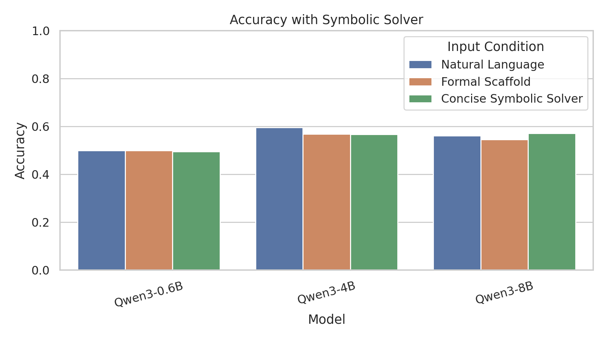
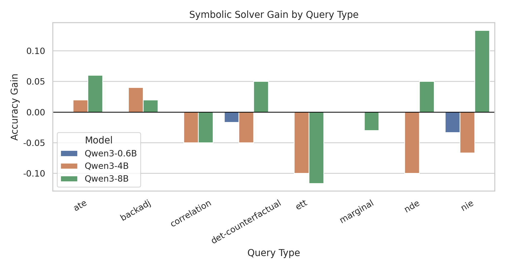

# MLISE 2026 符号分解辅助实验结果

- 生成时间：2026-05-13 12:30:10
- run_id：`final_20260513_090357`
- 输入条件：`symbolic_solver`，即自然语言题干加去答案化的符号因果分解。
- 图表标题与坐标轴使用英文；本报告正文使用中文。

## 方法定义

符号分解辅助输入保留自然语言问题，并附加变量映射、因果图、形式查询、公式模板和可用概率事实。生成输入时删除最终数值比较、最终符号判断和二值答案行；模型需要先识别问题要求的方向或阈值，再根据概率事实完成计算，最后输出 `Final answer: yes/no`。

该输入不是把答案写入 prompt，而是把 CLadder 问题中本来隐含的因果计算对象显式化，目标是检验结构化中间表示能否把形式信息转化为更稳定的行为收益。

## 总体结果

| model      | model_display_name   |   nl_accuracy |   nl_formal_accuracy |   symbolic_solver_accuracy |   gain_vs_nl |   gain_vs_nl_formal |   nl_strict_ccc |   symbolic_solver_strict_ccc |   nl_scca |   symbolic_solver_scca |
|:-----------|:---------------------|--------------:|---------------------:|---------------------------:|-------------:|--------------------:|----------------:|-----------------------------:|----------:|-----------------------:|
| qwen3_0_6b | Qwen3-0.6B           |        0.5    |               0.5    |                     0.4953 |      -0.0047 |             -0.0047 |          0      |                       0      |    0      |                 0      |
| qwen3_4b   | Qwen3-4B             |        0.5953 |               0.5688 |                     0.5672 |      -0.0281 |             -0.0016 |          0.4078 |                       0.4645 |    0.2905 |                 0.3521 |
| qwen3_8b   | Qwen3-8B             |        0.5609 |               0.5453 |                     0.5719 |       0.0109 |              0.0266 |          0.4441 |                       0.5062 |    0.3017 |                 0.3789 |

## 条件级指标

| model      | model_display_name   | diagnostic_source   | dataset_variant   | prompt_mode             | prompt_condition        |   n |   accuracy |   parse_rate |   invalid_rate |   latency_sec |   strict_ccc |   correct_flip_rate |   wrong_flip_rate |   scca |   signed_ccc |
|:-----------|:---------------------|:--------------------|:------------------|:------------------------|:------------------------|----:|-----------:|-------------:|---------------:|--------------:|-------------:|--------------------:|------------------:|-------:|-------------:|
| qwen3_0_6b | Qwen3-0.6B           | main                | main              | nl                      | Natural Language        | 640 |     0.5    |       1      |         0      |        0.0109 |       0      |              0      |            0      | 0      |       0      |
| qwen3_0_6b | Qwen3-0.6B           | main                | main              | nl_formal               | NL + Formal Scaffold    | 640 |     0.5    |       1      |         0      |        0.0113 |       0      |              0      |            0      | 0      |       0      |
| qwen3_0_6b | Qwen3-0.6B           | main                | main              | symbolic_solver_concise | Concise Symbolic Solver | 640 |     0.4953 |       0.9875 |         0.0125 |        0.0895 |       0      |              0      |            0      | 0      |       0      |
| qwen3_4b   | Qwen3-4B             | main                | main              | nl                      | Natural Language        | 640 |     0.5953 |       1      |         0      |        0.0292 |       0.4078 |              0.2905 |            0.1173 | 0.2905 |       0.1732 |
| qwen3_4b   | Qwen3-4B             | main                | main              | nl_formal               | NL + Formal Scaffold    | 640 |     0.5688 |       1      |         0      |        0.0338 |       0.4078 |              0.2821 |            0.1257 | 0.2821 |       0.1564 |
| qwen3_4b   | Qwen3-4B             | main                | main              | symbolic_solver_concise | Concise Symbolic Solver | 640 |     0.5672 |       0.9719 |         0.0281 |        0.4928 |       0.4645 |              0.3521 |            0.1124 | 0.3521 |       0.2396 |
| qwen3_8b   | Qwen3-8B             | main                | main              | nl                      | Natural Language        | 640 |     0.5609 |       1      |         0      |        0.054  |       0.4441 |              0.3017 |            0.1425 | 0.3017 |       0.1592 |
| qwen3_8b   | Qwen3-8B             | main                | main              | nl_formal               | NL + Formal Scaffold    | 640 |     0.5453 |       1      |         0      |        0.0625 |       0.4721 |              0.3128 |            0.1592 | 0.3128 |       0.1536 |
| qwen3_8b   | Qwen3-8B             | main                | main              | symbolic_solver_concise | Concise Symbolic Solver | 640 |     0.5719 |       0.9656 |         0.0344 |        0.9164 |       0.5062 |              0.3789 |            0.1273 | 0.3789 |       0.2516 |

## Query Type 细分

| model      | model_display_name   | query_type         |   nl_accuracy |   nl_formal_accuracy |   symbolic_solver_accuracy |   gain_vs_nl |   gain_vs_nl_formal |
|:-----------|:---------------------|:-------------------|--------------:|---------------------:|---------------------------:|-------------:|--------------------:|
| qwen3_0_6b | Qwen3-0.6B           | ate                |        0.5    |               0.5    |                     0.5    |       0      |              0      |
| qwen3_0_6b | Qwen3-0.6B           | backadj            |        0.5    |               0.5    |                     0.5    |       0      |              0      |
| qwen3_0_6b | Qwen3-0.6B           | correlation        |        0.5    |               0.5    |                     0.5    |       0      |              0      |
| qwen3_0_6b | Qwen3-0.6B           | det-counterfactual |        0.5    |               0.5    |                     0.4833 |      -0.0167 |             -0.0167 |
| qwen3_0_6b | Qwen3-0.6B           | ett                |        0.5    |               0.5    |                     0.5    |       0      |              0      |
| qwen3_0_6b | Qwen3-0.6B           | marginal           |        0.5    |               0.5    |                     0.5    |       0      |              0      |
| qwen3_0_6b | Qwen3-0.6B           | nde                |        0.5    |               0.5    |                     0.5    |       0      |              0      |
| qwen3_0_6b | Qwen3-0.6B           | nie                |        0.5    |               0.5    |                     0.4667 |      -0.0333 |             -0.0333 |
| qwen3_4b   | Qwen3-4B             | ate                |        0.74   |               0.73   |                     0.76   |       0.02   |              0.03   |
| qwen3_4b   | Qwen3-4B             | backadj            |        0.52   |               0.52   |                     0.56   |       0.04   |              0.04   |
| qwen3_4b   | Qwen3-4B             | correlation        |        0.65   |               0.56   |                     0.6    |      -0.05   |              0.04   |
| qwen3_4b   | Qwen3-4B             | det-counterfactual |        0.5833 |               0.5667 |                     0.5333 |      -0.05   |             -0.0333 |
| qwen3_4b   | Qwen3-4B             | ett                |        0.4667 |               0.4    |                     0.3667 |      -0.1    |             -0.0333 |
| qwen3_4b   | Qwen3-4B             | marginal           |        0.53   |               0.57   |                     0.53   |       0      |             -0.04   |
| qwen3_4b   | Qwen3-4B             | nde                |        0.6167 |               0.6167 |                     0.5167 |      -0.1    |             -0.1    |
| qwen3_4b   | Qwen3-4B             | nie                |        0.6167 |               0.5167 |                     0.55   |      -0.0667 |              0.0333 |
| qwen3_8b   | Qwen3-8B             | ate                |        0.76   |               0.71   |                     0.82   |       0.06   |              0.11   |
| qwen3_8b   | Qwen3-8B             | backadj            |        0.44   |               0.45   |                     0.46   |       0.02   |              0.01   |
| qwen3_8b   | Qwen3-8B             | correlation        |        0.55   |               0.55   |                     0.5    |      -0.05   |             -0.05   |
| qwen3_8b   | Qwen3-8B             | det-counterfactual |        0.5333 |               0.5    |                     0.5833 |       0.05   |              0.0833 |
| qwen3_8b   | Qwen3-8B             | ett                |        0.45   |               0.4333 |                     0.3333 |      -0.1167 |             -0.1    |
| qwen3_8b   | Qwen3-8B             | marginal           |        0.53   |               0.56   |                     0.5    |      -0.03   |             -0.06   |
| qwen3_8b   | Qwen3-8B             | nde                |        0.6333 |               0.55   |                     0.6833 |       0.05   |              0.1333 |
| qwen3_8b   | Qwen3-8B             | nie                |        0.5667 |               0.55   |                     0.7    |       0.1333 |              0.15   |

## 相对自然语言条件的样本迁移

| model      | model_display_name   |   n_valid |   prediction_change_count |   prediction_change_rate |   rescue_count |   harm_count |   net_rescue |   net_rescue_rate |
|:-----------|:---------------------|----------:|--------------------------:|-------------------------:|---------------:|-------------:|-------------:|------------------:|
| qwen3_0_6b | Qwen3-0.6B           |       632 |                         0 |                   0      |              0 |            0 |            0 |            0      |
| qwen3_4b   | Qwen3-4B             |       622 |                       160 |                   0.2572 |             77 |           83 |           -6 |           -0.0096 |
| qwen3_8b   | Qwen3-8B             |       618 |                       180 |                   0.2913 |             98 |           82 |           16 |            0.0259 |

## Accuracy Bootstrap 置信区间

| model      | model_display_name   | diagnostic_source   | dataset_variant   | prompt_mode             | metric   |   estimate |   ci_low |   ci_high |   n_bootstrap |
|:-----------|:---------------------|:--------------------|:------------------|:------------------------|:---------|-----------:|---------:|----------:|--------------:|
| qwen3_0_6b | Qwen3-0.6B           | main                | main              | nl                      | accuracy |     0.5    |   0.4641 |    0.5422 |          1000 |
| qwen3_0_6b | Qwen3-0.6B           | main                | main              | nl_formal               | accuracy |     0.5    |   0.4625 |    0.5375 |          1000 |
| qwen3_0_6b | Qwen3-0.6B           | main                | main              | symbolic_solver_concise | accuracy |     0.4953 |   0.4578 |    0.5344 |          1000 |
| qwen3_4b   | Qwen3-4B             | main                | main              | nl                      | accuracy |     0.5953 |   0.5609 |    0.6297 |          1000 |
| qwen3_4b   | Qwen3-4B             | main                | main              | nl_formal               | accuracy |     0.5688 |   0.5328 |    0.6063 |          1000 |
| qwen3_4b   | Qwen3-4B             | main                | main              | symbolic_solver_concise | accuracy |     0.5672 |   0.5296 |    0.6047 |          1000 |
| qwen3_8b   | Qwen3-8B             | main                | main              | nl                      | accuracy |     0.5609 |   0.5219 |    0.5984 |          1000 |
| qwen3_8b   | Qwen3-8B             | main                | main              | nl_formal               | accuracy |     0.5453 |   0.5078 |    0.5813 |          1000 |
| qwen3_8b   | Qwen3-8B             | main                | main              | symbolic_solver_concise | accuracy |     0.5719 |   0.5359 |    0.6109 |          1000 |

## 图表索引

### Accuracy with Symbolic Solver

### Symbolic Solver Gain by Query Type

## 论文结论写作要点

若 `symbolic_solver` 相对 `nl` 或 `nl_formal` 获得正向提升，正文应将核心贡献写为：形式信息的有效性取决于中间表示是否把查询方向、估计量和概率事实组织成可执行的计算过程。相较于只加入图结构或形式查询，符号分解辅助输入直接减少了从叙事到因果估计量的映射负担，因此更可能产生稳定收益。

若总体提升有限但在部分 query type 上明显提升，正文应避免写成全面有效，而应写成受任务类型约束的可行路径：符号分解在估计量明确、概率事实完整的因果问题中更有效；在 `backadj` 等缺少可用 trace 的类型上，收益受到输入结构质量限制。
