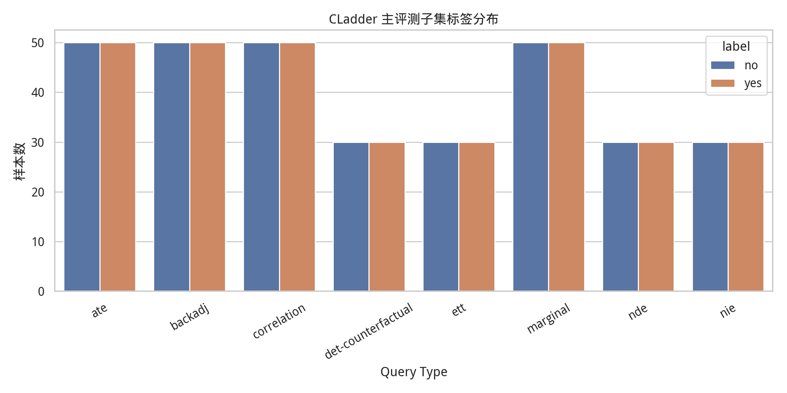
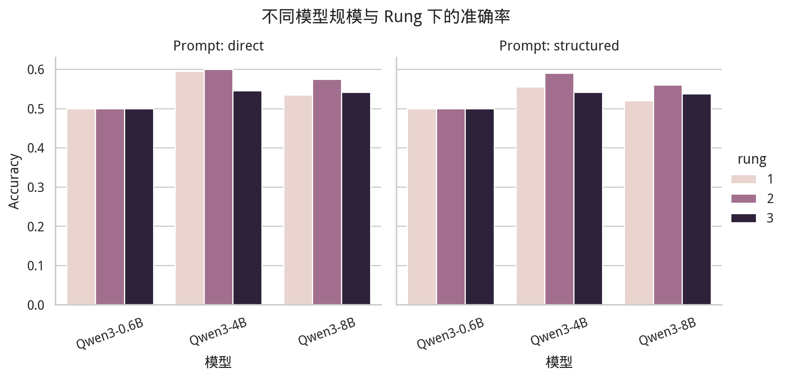
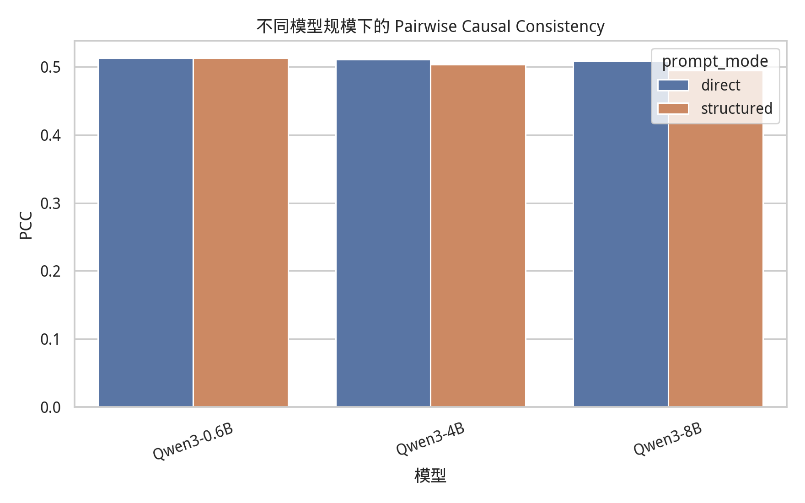
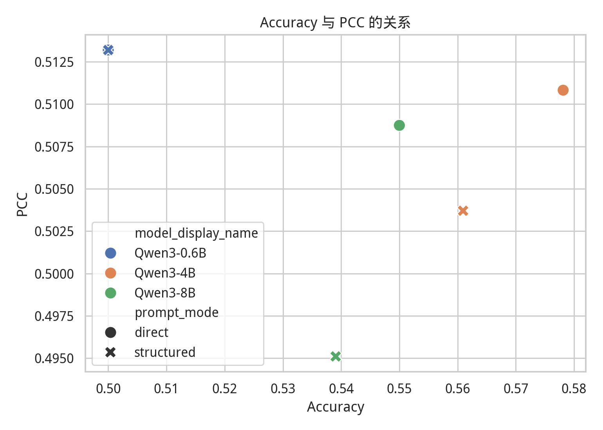
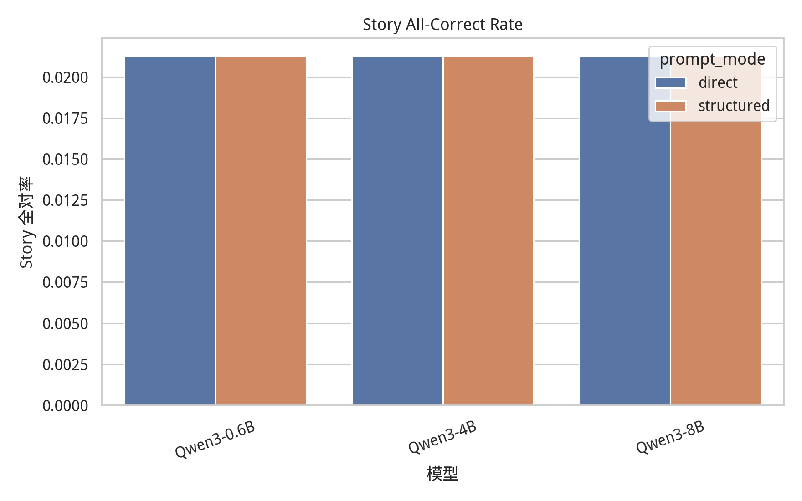
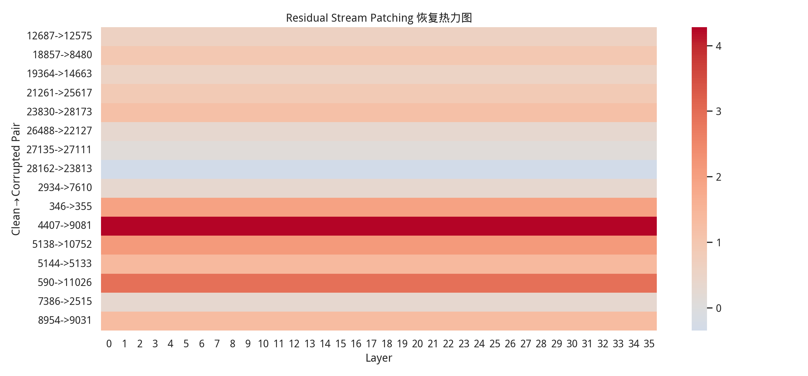

# MLISE 2026 Qwen 家族因果一致性实验报告

## 1. 实验概述

- 实验时间：2026-05-13 06:57:02
- 样本模式：`formal`
- 实验目标：比较 Qwen3 同一家族不同规模模型在 CLadder 因果推理任务上的准确率、因果一致性和 story 级稳定性，并在代表性模型上做轻量 residual stream activation patching。
- 报告语言：中文。

## 2. 服务器环境

- 记录时间：`2026-05-13 06:57:02`
- 主机名：`ubuntu`
- 系统：`Linux-6.8.0-111-generic-x86_64-with-glibc2.39`
- Python：`3.11.15 (main, Mar 11 2026, 17:20:07) [GCC 14.3.0]`
- PyTorch：`2.11.0+cu130`
- CUDA可用：`True`
- CUDA_VISIBLE_DEVICES：``
- CUDA版本：`13.0`
- GPU数量：`8`
- GPU列表：`['NVIDIA A100 80GB PCIe', 'NVIDIA A100 80GB PCIe', 'NVIDIA A100 80GB PCIe', 'NVIDIA A100 80GB PCIe', 'NVIDIA A100 80GB PCIe', 'NVIDIA A100 80GB PCIe', 'NVIDIA A100 80GB PCIe', 'NVIDIA A100 80GB PCIe']`
- Transformers：`5.8.1`
- TransformerLens可导入：`True`

## 3. 数据集与任务设置

本实验使用 `CLadder full_v1.5_default` 中的分层平衡抽样子集。每道题是一个 yes/no 形式的因果推理问题，模型需要根据题干中的因果结构、概率信息或反事实条件给出最终判断。

抽样时在每个 query type 内保持 yes/no 标签平衡。quick 版本用于服务器快速验证，formal 版本用于会议稿正式结果。

## 4. 模型设置

- Qwen3-0.6B：`/data/LLM/Qwen/Qwen3-0___6B`
- Qwen3-4B：`/data/LLM/Qwen/Qwen3-4B`
- Qwen3-8B：`/data/LLM/Qwen/Qwen3-8B`

## 5. Prompt 设置与解析规则

主实验只保留两种 prompt：`direct` 和 `structured`。模型输出只使用自动规则解析：优先提取 `Final answer: yes/no`，其次提取输出文本中的独立 yes/no；无法解析时记为 invalid。主实验不调用 DeepSeek 或其他外部模型修补答案。

## 6. 指标定义

- `Accuracy`：单题预测是否等于 CLadder oracle label。
- `Pairwise Causal Consistency (PCC)`：同一 story 下成对样本的预测关系是否与 oracle label 的保持或翻转关系一致。
- `Story All-Correct Rate`：同一 story 中被抽中的题目是否全部答对。
- `Residual patching recovery`：将 clean 样本 residual stream 激活写入 corrupted 样本后，clean 目标答案方向的 logit margin 变化。

## 7. 主结果表

| model      | model_display_name   | sample_mode   | prompt_mode   |   n |   accuracy |   parse_rate |   invalid_rate |   latency_sec |      pcc |   invalid_pair_rate |   story_all_correct_rate |   n_stories |
|:-----------|:---------------------|:--------------|:--------------|----:|-----------:|-------------:|---------------:|--------------:|---------:|--------------------:|-------------------------:|------------:|
| qwen3_0_6b | Qwen3-0.6B           | formal        | direct        | 640 |   0.5      |            1 |              0 |     0.0238246 | 0.513193 |                   0 |                0.0212766 |          47 |
| qwen3_0_6b | Qwen3-0.6B           | formal        | structured    | 640 |   0.5      |            1 |              0 |     0.0195785 | 0.513193 |                   0 |                0.0212766 |          47 |
| qwen3_4b   | Qwen3-4B             | formal        | direct        | 640 |   0.578125 |            1 |              0 |     0.0344998 | 0.510821 |                   0 |                0.0212766 |          47 |
| qwen3_4b   | Qwen3-4B             | formal        | structured    | 640 |   0.560937 |            1 |              0 |     0.0324599 | 0.503706 |                   0 |                0.0212766 |          47 |
| qwen3_8b   | Qwen3-8B             | formal        | direct        | 640 |   0.55     |            1 |              0 |     0.0399283 | 0.508746 |                   0 |                0.0212766 |          47 |
| qwen3_8b   | Qwen3-8B             | formal        | structured    | 640 |   0.539062 |            1 |              0 |     0.0389747 | 0.495108 |                   0 |                0.0212766 |          47 |

## 8. PCC 结果

| model      | model_display_name   | sample_mode   | prompt_mode   | transition   |    n |      pcc |   invalid_pair_rate |
|:-----------|:---------------------|:--------------|:--------------|:-------------|-----:|---------:|--------------------:|
| qwen3_0_6b | Qwen3-0.6B           | formal        | direct        | 1→2          |  997 | 0.52658  |                   0 |
| qwen3_0_6b | Qwen3-0.6B           | formal        | direct        | 1→3          | 1238 | 0.494346 |                   0 |
| qwen3_0_6b | Qwen3-0.6B           | formal        | direct        | 2→3          | 1138 | 0.521968 |                   0 |
| qwen3_0_6b | Qwen3-0.6B           | formal        | structured    | 1→2          |  997 | 0.52658  |                   0 |
| qwen3_0_6b | Qwen3-0.6B           | formal        | structured    | 1→3          | 1238 | 0.494346 |                   0 |
| qwen3_0_6b | Qwen3-0.6B           | formal        | structured    | 2→3          | 1138 | 0.521968 |                   0 |
| qwen3_4b   | Qwen3-4B             | formal        | direct        | 1→2          |  997 | 0.533601 |                   0 |
| qwen3_4b   | Qwen3-4B             | formal        | direct        | 1→3          | 1238 | 0.505654 |                   0 |
| qwen3_4b   | Qwen3-4B             | formal        | direct        | 2→3          | 1138 | 0.496485 |                   0 |
| qwen3_4b   | Qwen3-4B             | formal        | structured    | 1→2          |  997 | 0.514544 |                   0 |
| qwen3_4b   | Qwen3-4B             | formal        | structured    | 1→3          | 1238 | 0.496769 |                   0 |
| qwen3_4b   | Qwen3-4B             | formal        | structured    | 2→3          | 1138 | 0.501757 |                   0 |
| qwen3_8b   | Qwen3-8B             | formal        | direct        | 1→2          |  997 | 0.528586 |                   0 |
| qwen3_8b   | Qwen3-8B             | formal        | direct        | 1→3          | 1238 | 0.498384 |                   0 |
| qwen3_8b   | Qwen3-8B             | formal        | direct        | 2→3          | 1138 | 0.502636 |                   0 |
| qwen3_8b   | Qwen3-8B             | formal        | structured    | 1→2          |  997 | 0.496489 |                   0 |
| qwen3_8b   | Qwen3-8B             | formal        | structured    | 1→3          | 1238 | 0.491115 |                   0 |
| qwen3_8b   | Qwen3-8B             | formal        | structured    | 2→3          | 1138 | 0.498243 |                   0 |

## 9. Story All-Correct Rate

| model      | model_display_name   | sample_mode   | prompt_mode   |   n_stories |   story_all_correct_rate |
|:-----------|:---------------------|:--------------|:--------------|------------:|-------------------------:|
| qwen3_0_6b | Qwen3-0.6B           | formal        | direct        |          47 |                0.0212766 |
| qwen3_0_6b | Qwen3-0.6B           | formal        | structured    |          47 |                0.0212766 |
| qwen3_4b   | Qwen3-4B             | formal        | direct        |          47 |                0.0212766 |
| qwen3_4b   | Qwen3-4B             | formal        | structured    |          47 |                0.0212766 |
| qwen3_8b   | Qwen3-8B             | formal        | direct        |          47 |                0.0212766 |
| qwen3_8b   | Qwen3-8B             | formal        | structured    |          47 |                0.0212766 |

## 10. Query Type 结果

| model      | model_display_name   | sample_mode   | prompt_mode   | query_type         |   n |   accuracy |   parse_rate |
|:-----------|:---------------------|:--------------|:--------------|:-------------------|----:|-----------:|-------------:|
| qwen3_0_6b | Qwen3-0.6B           | formal        | direct        | ate                | 100 |   0.5      |            1 |
| qwen3_0_6b | Qwen3-0.6B           | formal        | direct        | backadj            | 100 |   0.5      |            1 |
| qwen3_0_6b | Qwen3-0.6B           | formal        | direct        | correlation        | 100 |   0.5      |            1 |
| qwen3_0_6b | Qwen3-0.6B           | formal        | direct        | det-counterfactual |  60 |   0.5      |            1 |
| qwen3_0_6b | Qwen3-0.6B           | formal        | direct        | ett                |  60 |   0.5      |            1 |
| qwen3_0_6b | Qwen3-0.6B           | formal        | direct        | marginal           | 100 |   0.5      |            1 |
| qwen3_0_6b | Qwen3-0.6B           | formal        | direct        | nde                |  60 |   0.5      |            1 |
| qwen3_0_6b | Qwen3-0.6B           | formal        | direct        | nie                |  60 |   0.5      |            1 |
| qwen3_0_6b | Qwen3-0.6B           | formal        | structured    | ate                | 100 |   0.5      |            1 |
| qwen3_0_6b | Qwen3-0.6B           | formal        | structured    | backadj            | 100 |   0.5      |            1 |
| qwen3_0_6b | Qwen3-0.6B           | formal        | structured    | correlation        | 100 |   0.5      |            1 |
| qwen3_0_6b | Qwen3-0.6B           | formal        | structured    | det-counterfactual |  60 |   0.5      |            1 |
| qwen3_0_6b | Qwen3-0.6B           | formal        | structured    | ett                |  60 |   0.5      |            1 |
| qwen3_0_6b | Qwen3-0.6B           | formal        | structured    | marginal           | 100 |   0.5      |            1 |
| qwen3_0_6b | Qwen3-0.6B           | formal        | structured    | nde                |  60 |   0.5      |            1 |
| qwen3_0_6b | Qwen3-0.6B           | formal        | structured    | nie                |  60 |   0.5      |            1 |
| qwen3_4b   | Qwen3-4B             | formal        | direct        | ate                | 100 |   0.67     |            1 |
| qwen3_4b   | Qwen3-4B             | formal        | direct        | backadj            | 100 |   0.53     |            1 |
| qwen3_4b   | Qwen3-4B             | formal        | direct        | correlation        | 100 |   0.66     |            1 |
| qwen3_4b   | Qwen3-4B             | formal        | direct        | det-counterfactual |  60 |   0.516667 |            1 |
| qwen3_4b   | Qwen3-4B             | formal        | direct        | ett                |  60 |   0.433333 |            1 |
| qwen3_4b   | Qwen3-4B             | formal        | direct        | marginal           | 100 |   0.53     |            1 |
| qwen3_4b   | Qwen3-4B             | formal        | direct        | nde                |  60 |   0.666667 |            1 |
| qwen3_4b   | Qwen3-4B             | formal        | direct        | nie                |  60 |   0.566667 |            1 |
| qwen3_4b   | Qwen3-4B             | formal        | structured    | ate                | 100 |   0.66     |            1 |
| qwen3_4b   | Qwen3-4B             | formal        | structured    | backadj            | 100 |   0.52     |            1 |
| qwen3_4b   | Qwen3-4B             | formal        | structured    | correlation        | 100 |   0.61     |            1 |
| qwen3_4b   | Qwen3-4B             | formal        | structured    | det-counterfactual |  60 |   0.483333 |            1 |
| qwen3_4b   | Qwen3-4B             | formal        | structured    | ett                |  60 |   0.55     |            1 |
| qwen3_4b   | Qwen3-4B             | formal        | structured    | marginal           | 100 |   0.5      |            1 |
| qwen3_4b   | Qwen3-4B             | formal        | structured    | nde                |  60 |   0.6      |            1 |
| qwen3_4b   | Qwen3-4B             | formal        | structured    | nie                |  60 |   0.533333 |            1 |
| qwen3_8b   | Qwen3-8B             | formal        | direct        | ate                | 100 |   0.74     |            1 |
| qwen3_8b   | Qwen3-8B             | formal        | direct        | backadj            | 100 |   0.41     |            1 |
| qwen3_8b   | Qwen3-8B             | formal        | direct        | correlation        | 100 |   0.63     |            1 |
| qwen3_8b   | Qwen3-8B             | formal        | direct        | det-counterfactual |  60 |   0.566667 |            1 |
| qwen3_8b   | Qwen3-8B             | formal        | direct        | ett                |  60 |   0.466667 |            1 |
| qwen3_8b   | Qwen3-8B             | formal        | direct        | marginal           | 100 |   0.44     |            1 |
| qwen3_8b   | Qwen3-8B             | formal        | direct        | nde                |  60 |   0.516667 |            1 |
| qwen3_8b   | Qwen3-8B             | formal        | direct        | nie                |  60 |   0.616667 |            1 |
| qwen3_8b   | Qwen3-8B             | formal        | structured    | ate                | 100 |   0.71     |            1 |
| qwen3_8b   | Qwen3-8B             | formal        | structured    | backadj            | 100 |   0.41     |            1 |
| qwen3_8b   | Qwen3-8B             | formal        | structured    | correlation        | 100 |   0.59     |            1 |
| qwen3_8b   | Qwen3-8B             | formal        | structured    | det-counterfactual |  60 |   0.55     |            1 |
| qwen3_8b   | Qwen3-8B             | formal        | structured    | ett                |  60 |   0.45     |            1 |
| qwen3_8b   | Qwen3-8B             | formal        | structured    | marginal           | 100 |   0.45     |            1 |
| qwen3_8b   | Qwen3-8B             | formal        | structured    | nde                |  60 |   0.533333 |            1 |
| qwen3_8b   | Qwen3-8B             | formal        | structured    | nie                |  60 |   0.616667 |            1 |

## 11. 输出标签分布

| model      | model_display_name   | prompt_mode   | parsed_label   |   n |
|:-----------|:---------------------|:--------------|:---------------|----:|
| qwen3_0_6b | Qwen3-0.6B           | direct        | yes            | 640 |
| qwen3_0_6b | Qwen3-0.6B           | structured    | yes            | 640 |
| qwen3_4b   | Qwen3-4B             | direct        | no             | 302 |
| qwen3_4b   | Qwen3-4B             | direct        | yes            | 338 |
| qwen3_4b   | Qwen3-4B             | structured    | no             | 269 |
| qwen3_4b   | Qwen3-4B             | structured    | yes            | 371 |
| qwen3_8b   | Qwen3-8B             | direct        | no             | 400 |
| qwen3_8b   | Qwen3-8B             | direct        | yes            | 240 |
| qwen3_8b   | Qwen3-8B             | structured    | no             | 369 |
| qwen3_8b   | Qwen3-8B             | structured    | yes            | 271 |

## 12. 白盒 Patching 结果

本轮白盒分析只做 residual stream patching，作为行为结果之外的轻量内部信号检查。该结果不能解释为完整 causal circuit，只能说明部分隐藏状态中可能存在与答案方向相关的可恢复信号。

| model    | model_display_name   |   n_rows |   n_pairs |   positive_pair_ratio |   mean_recovery |   max_recovery |
|:---------|:---------------------|---------:|----------:|----------------------:|----------------:|---------------:|
| qwen3_4b | Qwen3-4B             |      576 |        16 |                0.9375 |         1.18164 |        4.28125 |

## 13. 图表索引

### CLadder 主评测子集标签分布

### 不同模型规模与 Rung 下的准确率

### 不同模型规模下的 Pairwise Causal Consistency

### Accuracy 与 PCC 的关系

### Story All-Correct Rate

### Residual Stream Patching 恢复热力图

## 14. 中文实验描述草稿

本文在 CLadder 因果推理基准上评估 Qwen3 家族模型的因果一致性。与只统计单题准确率不同，实验进一步计算同一 story 下不同 causal condition 之间的 Pairwise Causal Consistency，以及更严格的 Story All-Correct Rate。这样的设置可以检验模型是否只是偶然答对个别问题，还是能在共享因果结构的一组问题中保持稳定判断。

隐藏层分析部分采用 residual stream activation patching。我们首先筛选 clean/corrupted 样本对，其中 clean 样本是模型答对的一侧，corrupted 样本是模型答错的一侧。随后在 corrupted 样本前向传播时，将某一层 residual stream 激活替换为 clean 样本对应层激活，并观察 yes/no logit margin 是否向 clean 样本正确答案方向恢复。该分析只作为探索性补充证据，不声称发现完整因果推理回路。

## 15. 初步结论与下一步

正式结论需要结合服务器完整结果填写。若更大模型在 Accuracy、PCC 或 Story All-Correct Rate 上显著高于 0.6B，可将论文主线写成模型规模带来部分因果一致性改善；若提升不明显，则可将主线转为通用规模扩展并不自动保证因果一致性，因果评测仍需要专门指标。

下一步建议：检查 formal 版本三模型是否完整，核对 parse rate 和标签偏置；若 patching pair 不足，优先改用 Qwen3-8B 或扩大 candidate pool。
