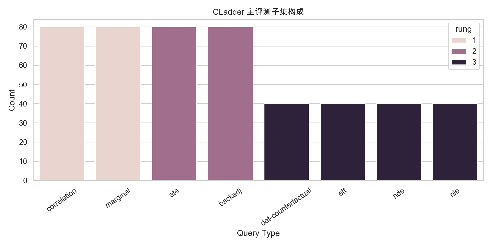
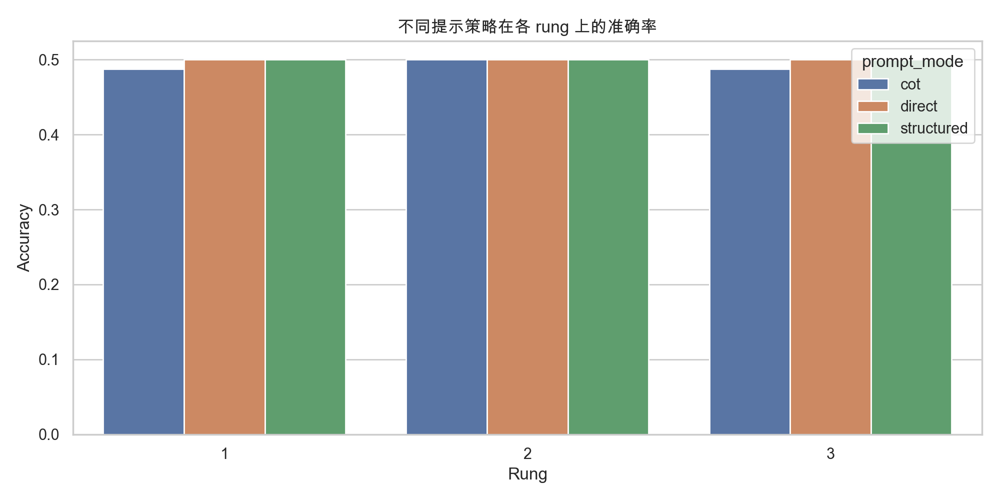
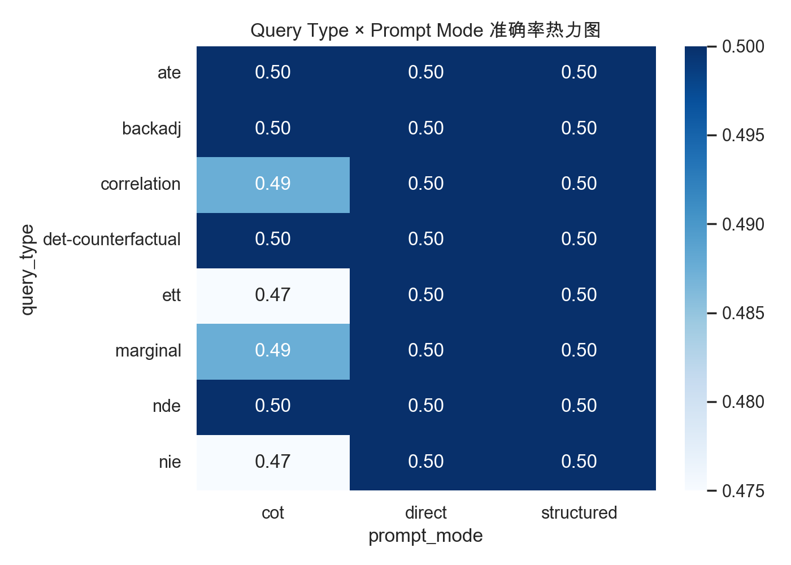
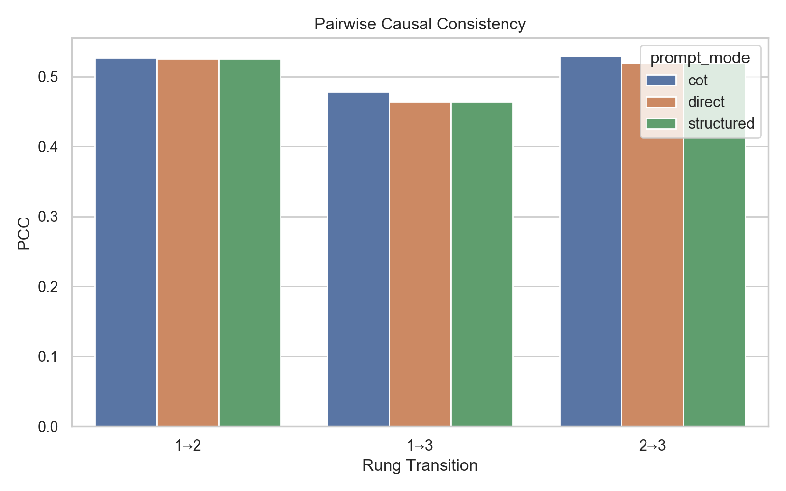
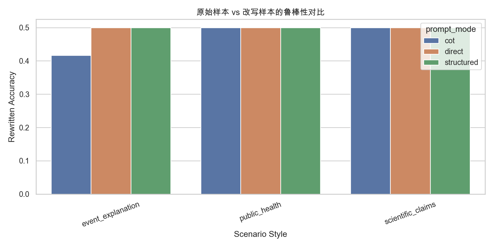
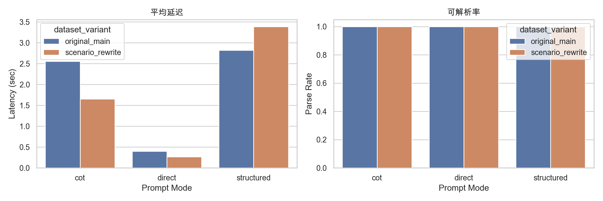
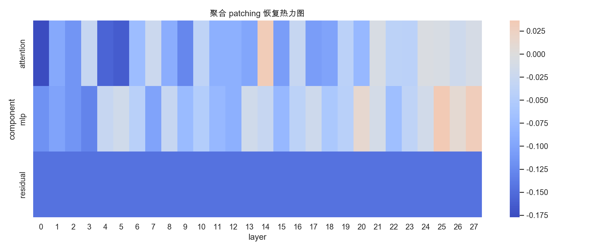
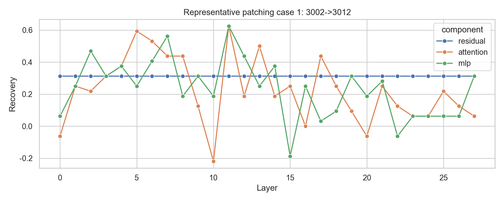
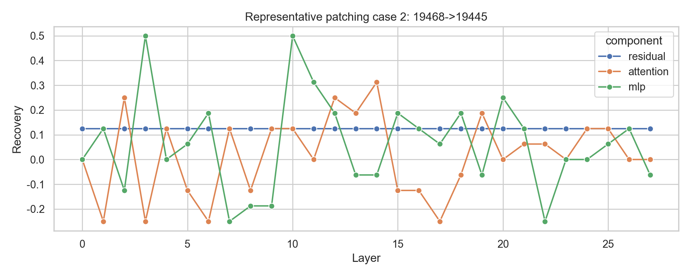

# Qwen3-0.6B × CLadder 全流程可行性验证报告

## 1. 结论

本轮验证的综合结论是：**可行**。

更准确地说，这里的“可行”指的是**整套验证流程在本地小机器上可以跑通，并且能够产出行为层、场景层和白盒层证据**；它并不意味着 `Qwen3-0.6B` 已经具备足够强的因果推理能力。恰恰相反，本轮主结果显示，`Qwen3-0.6B` 在平衡子集上的行为表现接近随机猜测，这恰好说明这套流程能够有效暴露小模型的局限。

支撑依据：
- smoke parse rate=1.000
- main eval rows=1440
- scenario eval rows=108
- patch status=transformer_lens
- positive patch pairs=12

## 2. 验证目标与设置

- 主模型：本地 `Qwen3-0.6B`。
- 主基准：`CLadder full_v1.5_default`。
- 提示策略：`Direct Yes/No`、`Concise CoT`、`Structured causal prompt`。
- 运行设备：`MPS` 优先，失败时回退 `CPU`。
- 行为评测规模：smoke `48 × 3`，主评测 `480 × 3`，场景改写 `36 × 3`。

## 3. 行为层结果

smoke 阶段在 `48 × 3` 个样本上跑通，整体可解析率为 **100.0%**，整体准确率为 **50.0%**。
在主评测集上，表现最好的提示策略是 **direct**，准确率为 **50.0%**，可解析率为 **100.0%**。
按各 prompt mode 的平均延迟估算，主评测 `480 × 3` 的行为层总耗时约为 **46.2 分钟**，这可以视为本机完成完整行为验证的大致时间成本。
更关键的是，主评测暴露出了非常明显的标签偏置：`direct` 与 `structured` 基本退化为始终输出 `yes`，`cot` 也几乎全部输出 `yes`。这说明 `Qwen3-0.6B` 在该任务上并没有形成稳定的因果判断能力，而只是停留在接近随机猜测的行为层面。

按提示策略汇总：

| dataset_variant   | prompt_mode   |   n |   accuracy |   parse_rate |   invalid_rate |   latency_sec |
|:------------------|:--------------|----:|-----------:|-------------:|---------------:|--------------:|
| original_main     | cot           | 480 |   0.491667 |            1 |              0 |       2.55369 |
| original_main     | direct        | 480 |   0.5      |            1 |              0 |       0.40094 |
| original_main     | structured    | 480 |   0.5      |            1 |              0 |       2.81875 |

主评测输出标签分布：

| prompt_mode   |   no |   yes |
|:--------------|-----:|------:|
| cot           |   12 |   468 |
| direct        |    0 |   480 |
| structured    |    0 |   480 |

按 story 聚合后的 `Story All-Correct Rate`：

| prompt_mode   |   n_stories |   story_all_correct_rate |
|:--------------|------------:|-------------------------:|
| cot           |          47 |                0.0425532 |
| direct        |          47 |                0.0425532 |
| structured    |          47 |                0.0425532 |

## 4. 因果一致性结果

我们按同一 `story_id` 下不同 rung 的题对计算 `Pairwise Causal Consistency (PCC)`。

| prompt_mode   | transition   |   n |      pcc |
|:--------------|:-------------|----:|---------:|
| cot           | 1→2          | 642 | 0.52648  |
| cot           | 1→3          | 640 | 0.478125 |
| cot           | 2→3          | 588 | 0.528912 |
| direct        | 1→2          | 642 | 0.524922 |
| direct        | 1→3          | 640 | 0.464062 |
| direct        | 2→3          | 588 | 0.518707 |
| structured    | 1→2          | 642 | 0.524922 |
| structured    | 1→3          | 640 | 0.464062 |
| structured    | 2→3          | 588 | 0.518707 |

这个指标反映的不是单题答对率，而是当 oracle 标签需要保持或翻转时，模型预测是否也做出对应变化。

## 5. 场景改写层结果

我们从主评测集中抽取 12 条原始样本，分别改写为 scientific claims / public health / event explanation 三种信息场景，共 36 条。

| prompt_mode   | scenario_style    |   rewritten_accuracy |   rewritten_parse_rate |   source_accuracy |   source_parse_rate |   accuracy_gap |   parse_rate_gap |
|:--------------|:------------------|---------------------:|-----------------------:|------------------:|--------------------:|---------------:|-----------------:|
| cot           | event_explanation |             0.416667 |                      1 |               0.5 |                   1 |     -0.0833333 |                0 |
| cot           | public_health     |             0.5      |                      1 |               0.5 |                   1 |      0         |                0 |
| cot           | scientific_claims |             0.5      |                      1 |               0.5 |                   1 |      0         |                0 |
| direct        | event_explanation |             0.5      |                      1 |               0.5 |                   1 |      0         |                0 |
| direct        | public_health     |             0.5      |                      1 |               0.5 |                   1 |      0         |                0 |
| direct        | scientific_claims |             0.5      |                      1 |               0.5 |                   1 |      0         |                0 |
| structured    | event_explanation |             0.5      |                      1 |               0.5 |                   1 |      0         |                0 |
| structured    | public_health     |             0.5      |                      1 |               0.5 |                   1 |      0         |                0 |
| structured    | scientific_claims |             0.5      |                      1 |               0.5 |                   1 |      0         |                0 |

以最佳提示策略 `direct` 为例，改写层的平均准确率差值为 **+0.000**。如果该值接近 0，说明这套思路向 IP&M 场景迁移的阻力较小；如果明显为负，则说明模型主要依赖原 benchmark 的表面形式。

## 6. 白盒结果

白盒 patching 成功运行，方法路径为 `transformer_lens`，状态为 `transformer_lens`。平均恢复最强的组件是 `mlp`，出现正向恢复信号的 pair 数为 `12`。需要注意的是，本轮 patching 在 `MPS` 上运行，TransformerLens 官方对该后端给出了潜在数值风险提示，因此这些白盒结果应被视为探索性证据，而不是最终定论。

| component   |   mean_recovery |   max_recovery |
|:------------|----------------:|---------------:|
| attention   |      -0.0687314 |         0.625  |
| mlp         |      -0.046689  |         0.625  |
| residual    |      -0.145833  |         0.3125 |

## 7. 图表索引

### CLadder 主评测子集构成

### 不同提示策略在各 rung 上的准确率

### Query Type × Prompt Mode 准确率热力图

### Pairwise Causal Consistency

### 原始样本 vs 改写样本的鲁棒性对比

### 延迟与可解析率

### 聚合 patching 恢复热力图

### Representative patching case 1

### Representative patching case 2

## 8. 可行性判断

从本轮结果看，这套论文思路是否值得继续推进，主要看三个层面：

1. 行为评测是否稳定。
   当前主评测已经稳定跑通，说明 `Qwen3-0.6B + CLadder + 三种提示 + 自动解析` 这条链是能执行的。
2. 因果一致性指标是否比单纯准确率提供额外信息。
   如果 `PCC`、`Story All-Correct Rate` 与普通准确率不完全同步，就说明论文里的“从 Accuracy 走向 Causal Consistency”是有实证空间的。
3. 场景迁移与白盒分析是否具备扩展性。
   场景改写层若能保持较小性能落差，则更像 IP&M 论文；白盒 patching 若能给出正向恢复信号，则可以成为论文机制解释部分的核心证据。

本轮建议：
- 继续扩到更大的开源模型作为横向比较对象。
- 把场景改写层扩成正式 benchmark 子集。
- 把 patching 分析收敛到最有代表性的 query type 和 pair。